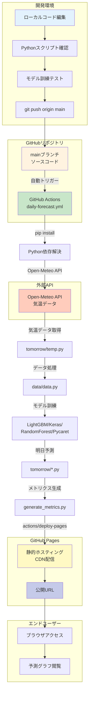
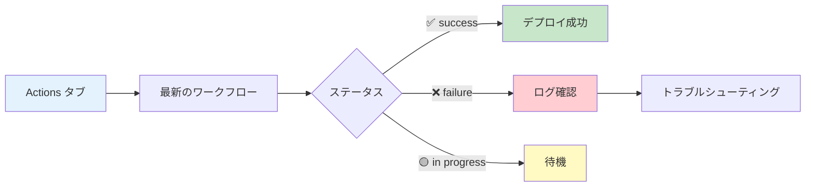
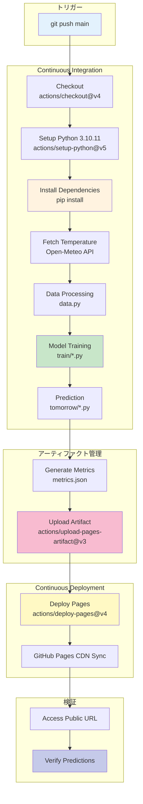
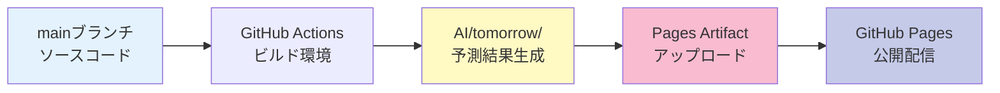

# GitHub Pages デプロイ完全ガイド

電力需要予測システムを GitHub Pages で本番運用するための完全なデプロイガイドです。

**バージョン**: 1.0.0  
**最終更新**: 2025年11月26日  
**ステータス**: ✅ GitHub Actions ワークフロー完全対応  
**公開URL**: https://j1921604.github.io/Power-Demand-Forecast/  
**Actions**: https://github.com/J1921604/Power-Demand-Forecast/actions

---

## 📋 目次

1. [システム概要](#システム概要)
2. [⚠️ 重要: デプロイ方式の選択](#重要-デプロイ方式の選択)
3. [クイックスタート](#クイックスタート)
4. [自動デプロイ（GitHub Actions）](#自動デプロイgithub-actions)
5. [GitHub Pages設定](#github-pages設定)
6. [トラブルシューティング](#トラブルシューティング)
7. [デプロイ前チェックリスト](#デプロイ前チェックリスト)
8. [CI/CDパイプライン詳細](#cicdパイプライン詳細)

---

## ⚠️ 重要: デプロイ方式の選択

### GitHub Pages には2つのデプロイ方式があります

本プロジェクトは **GitHub Actions（Source）** 方式を使用します。

| デプロイ方式                       | 説明                                           | 本プロジェクトでの適用                     |
| ---------------------------------- | ---------------------------------------------- | ------------------------------------------ |
| **GitHub Actions（Source）** | GitHub Actions ワークフローからデプロイ        | ✅**正しい設定**                     |
| **Deploy from a branch**     | ブランチから直接デプロイ（静的コンテンツ専用） | ❌**このプロジェクトでは使用しない** |

### なぜ GitHub Actions（Source）設定が正しいか

本プロジェクトは以下の動的処理を行うため、**ワークフロー実行が必須**です：

1. **Open-Meteo API から最新気温データを取得** (`tomorrow/temp.py`)
2. **データ処理・特徴量エンジニアリング** (`data/data.py`)
3. **機械学習モデルの訓練** (`train/*/***_train.py`)
4. **明日の電力需要を予測** (`tomorrow/*/***_tomorrow.py`)
5. **メトリクス JSON を生成** (`generate_metrics.py`)

これらの Python スクリプトは **GitHub Actions ランナー上で実行**され、生成された成果物（予測グラフ、`metrics.json` など）が Pages に配信されます。

**重要**:

- `Settings → Pages → Source: GitHub Actions` に設定すると、ワークフローの `actions/deploy-pages@v4` ステップが成果物をデプロイ
- `.github/workflows/daily-forecast.yml` の `schedule` トリガーにより、**毎日 JST 07:00 に自動でモデル訓練・予測が実行される**（手動操作不要）

### ✅ GitHub Actions（Source）が正しく動作する理由

`Source: GitHub Actions` を選択すると、以下のように動作します：

| 動作                                      | 説明                                                | 結果                          |
| ----------------------------------------- | --------------------------------------------------- | ----------------------------- |
| **Push トリガーでワークフロー実行** | `.github/workflows/daily-forecast.yml` が自動実行 | Python スクリプトが実行される |
| **`metrics.json` が生成される**   | `generate_metrics.py` が実行される                | ダッシュボードが正常に動作    |
| **予測グラフが更新される**          | `tomorrow/*.py` が実行される                      | 最新データで予測              |
| **毎日の自動更新が可能**            | Cron トリガーが有効                                 | JST 07:00 に自動実行          |
| **GitHub Pages に自動デプロイ**     | `actions/deploy-pages@v4` が成果物をデプロイ      | サイトが自動更新              |

### ✅ GitHub Actions + ワークフロー実行の利点

| 利点                     | 説明                                           |
| ------------------------ | ---------------------------------------------- |
| **完全自動化**     | 毎日 JST 07:00 に自動で予測更新                |
| **最新データ**     | Open-Meteo API から最新気温を取得              |
| **動的生成**       | モデル訓練 → 予測 → メトリクス生成を自動実行 |
| **精度監視**       | R² < 0.8 のとき自動で Issue 作成              |
| **リポジトリ同期** | 予測結果を自動コミット・プッシュ               |

---

## システム概要

### ⚠️ 重要: ワークフローについて

本プロジェクトでは**`daily-forecast.yml`のみ**を使用します。

| ワークフロー                                       | 用途                                | ステータス             |
| -------------------------------------------------- | ----------------------------------- | ---------------------- |
| **`.github/workflows/daily-forecast.yml`** | **Power-Demand-Forecast専用** | ✅**アクティブ** |

- Python環境、機械学習モデル訓練、予測実行、自動デプロイを実行
- 毎日JST 07:00に自動実行（UTC 22:00 Cron）
- mainブランチへのPush時にも実行

### アーキテクチャ



### デプロイフロー概要

| ステップ        | 実行場所     | 処理内容                                   | 想定時間         |
| --------------- | ------------ | ------------------------------------------ | ---------------- |
| 1. コミット     | ローカル     | `git push origin main`                   | -                |
| 2. トリガー     | GitHub       | GitHub Actions 起動（JST 07:00 or Push時） | 即時～定時       |
| 3. セットアップ | CI/CD        | `pip install -r requirements.txt`        | 30-60秒          |
| 4. データ取得   | CI/CD        | Open-Meteo APIから気温取得                 | 5-10秒           |
| 5. データ処理   | CI/CD        | 特徴量エンジニアリング                     | 10-20秒          |
| 6. モデル訓練   | CI/CD        | LightGBM/Keras/RF/Pycaret訓練              | 2-5分            |
| 7. 明日予測     | CI/CD        | 各モデルで予測実行                         | 10-30秒          |
| 8. メトリクス   | CI/CD        | metrics.json生成                           | 5秒              |
| 9. デプロイ     | CI/CD        | GitHub Pages へデプロイ                    | 10-20秒          |
| 10. 配信        | GitHub Pages | CDN反映                                    | 1-2分            |
| **合計**  | -            | -                                          | **5-10分** |

---

## 🚀 クイックスタート

### 前提条件

- ✅ Python 3.10.11 インストール済み
- ✅ pip インストール済み
- ✅ Git インストール済み
- ✅ GitHubアカウント作成済み

### 5分でデプロイ

#### ステップ1: 前提条件確認

#### 必須環境

- **Python 3.10.11**: 必須（他のバージョンは非対応）
- pip インストール済み
- Git インストール済み
- GitHubアカウント作成済み

#### Python環境確認スクリプト実行

プロジェクトルートで以下を実行：

```powershell
# Python 3.10.11環境確認
.\.github\scripts\check-python.ps1

# 詳細モード（全パッケージチェック）
.\.github\scripts\check-python.ps1 -Verbose
```

**スクリプトが確認する項目**:

- ✅ Python 3.10.11の検出（`py -3.10 --version`）
- ✅ Python実行可能パスの確認
- ✅ `AI/requirements.txt`の全パッケージインストール状況（26パッケージ）
- ✅ 重要モジュールのインポート確認（pandas、numpy、sklearn、lightgbm、tensorflow、pycaret）

**成功時の出力例**:

```
================================================================
  ✓ Python 3.10.11 environment check passed
================================================================

Summary:
  Python: Python 3.10.11
  Executable: C:\Users\...\Python\Python310\python.exe
  Dependencies: All installed
  Imports: All successful
```

**失敗時の対処**:

1. **Python 3.10.11がない場合**:
   - [Python 3.10.11をダウンロード](https://www.python.org/downloads/release/python-31011/)
   - インストーラー実行時に「**Add Python to PATH**」をチェック
   - 確認: `py -3.10 --version`

2. **依存パッケージが未インストールの場合**:
   ```bash
   cd AI
   py -3.10 -m pip install -r requirements.txt
   ```

3. **インポートエラーの場合**:
   - パッケージバージョン競合を確認
   - 仮想環境（venv）の使用を推奨

#### ステップ2: リポジトリクローン

```bash
git clone https://github.com/J1921604/Power-Demand-Forecast.git
cd Power-Demand-Forecast
```

#### ステップ3: Python環境セットアップ

```bash
# 依存パッケージインストール
cd AI
py -3.10 -m pip install -r requirements.txt
```

**仮想環境を使用する場合（推奨）**:

```powershell
# プロジェクトルートで仮想環境作成
py -3.10 -m venv .venv

# 仮想環境有効化
.venv\Scripts\Activate.ps1

# 依存パッケージインストール
cd AI
pip install -r requirements.txt
```

**インストール確認**:

```powershell
# プロジェクトルートに戻る
cd ..

# 環境確認スクリプト実行
.\.github\scripts\check-python.ps1 -Verbose
```

すべて`✓`が表示されればセットアップ成功。

#### ステップ4: ローカルダッシュボード起動

**方法1: ワンコマンド起動（推奨）**

```powershell
# プロジェクトルートで実行
.\start-dashboard.ps1
```

自動的に以下が実行されます：
- Python 3.10検出
- 依存パッケージチェック
- HTTPサーバー起動（http://localhost:8002/）
- ブラウザ自動起動

**方法2: 手動起動**

```bash
cd AI
py -3.10 server.py

# ブラウザ自動起動（http://localhost:8002/）
```

#### ステップ4: 動作確認（ローカル）

```bash
# データ取得テスト
cd AI
py -3.10 tomorrow/temp.py

# データ処理テスト
py -3.10 data/data.py

# モデル訓練テスト（LightGBMのみ）
py -3.10 train/LightGBM/LightGBM_train.py

# 予測テスト
py -3.10 tomorrow/LightGBM/LightGBM_tomorrow.py
```

#### ステップ5: ローカルプレビュー確認（静的ファイル）

```bash
# プロジェクトルートに戻る
cd ..

# 静的ファイルHTTPサーバー起動
py -3.10 -m http.server 8080

# ブラウザで http://localhost:8080 を開く
```

#### ステップ5: GitHub Pages 設定（初回のみ必須）

**✅ 正しい設定**: `GitHub Actions` を選択してください。

1. リポジトリの **Settings** → **Pages** を開く
2. **Source** のドロップダウンで「**GitHub Actions**」を選択
3. **自動で更新される** をクリック

**確認方法**:

```
Settings → Pages → Source: GitHub Actions
```

**❌ 間違った設定例**:

```
Source: Deploy from a branch
```

→ この設定では GitHub Actions ワークフローからの自動デプロイが機能しません。

#### ステップ6: ワークフロー手動実行（任意）

**注意**: ワークフローは毎日 JST 07:00 に **Cron トリガーで自動実行**されるため、手動実行は任意です。初回デプロイ直後に動作確認したい場合のみ実行してください。

1. https://github.com/J1921604/Power-Demand-Forecast/actions を開く
2. 左側メニューから「**Daily Power Demand Forecast**」を選択
3. 右上の「**Run workflow**」ボタンをクリック
4. ブランチ「**main**」を確認して「**Run workflow**」をクリック
5. ワークフローが開始されるまで数秒待つ

**または**: コードをプッシュしてトリガー

```bash
# mainブランチへプッシュ
git checkout main
git pull origin main
git add .
git commit -m "deploy: Initial release"
git push origin main
```

#### ステップ8: GitHub Actions確認

1. https://github.com/J1921604/Power-Demand-Forecast/actions を開く
2. 「Daily Power Demand Forecast」ワークフロー実行を確認
3. ✅ All jobs succeeded になるまで待つ(約5-10分)

#### ステップ9: 公開サイトアクセス

```
https://j1921604.github.io/Power-Demand-Forecast/
```

✅ 4モデルの予測グラフと精度指標が表示されれば成功!

---

## ⚙️ 自動デプロイ（GitHub Actions）

### ワークフロー設定

**ファイル**: `.github/workflows/daily-forecast.yml`

```yaml
name: Daily Power Demand Forecast

on:
  schedule:
    # 毎日 UTC 22:00 (JST 07:00) に実行
    - cron: '0 22 * * *'
  workflow_dispatch:
  push:
    branches:
      - main

permissions:
  contents: write    # リポジトリへの書き込み権限（予測結果コミット用）
  pages: write       # GitHub Pages書き込み権限
  id-token: write    # OIDC トークン発行権限
  issues: write      # Issue作成権限（精度低下時通知用）

jobs:
  forecast:
    runs-on: ubuntu-latest
    env:
      AI_TARGET_YEARS: '2022,2023,2024'  # 学習年を一括設定
      PYTHONIOENCODING: 'utf-8'
    steps:
      - name: Checkout
        uses: actions/checkout@v4
  
      - name: Setup Python
        uses: actions/setup-python@v5
        with:
          python-version: '3.10.11'
          cache: 'pip'
  
      - name: Install dependencies
        run: |
          python -m pip install --upgrade pip
          pip install -r AI/requirements.txt
  
      - name: Fetch latest temperature data
        run: |
          cd AI
          python tomorrow/temp.py
  
      - name: Train models and predict
        run: |
          cd AI
          python data/data.py
          python train/LightGBM/LightGBM_train.py
          python tomorrow/LightGBM/LightGBM_tomorrow.py
          # その他のモデルも同様に実行...
  
      - name: Deploy to GitHub Pages
        uses: actions/deploy-pages@v4
```

### 学習年の変更方法

**重要**: AI_TARGET_YEARS 環境変数を job レベルで一括設定しているため、変更は1箇所のみで済みます。

```yaml
jobs:
  forecast:
    runs-on: ubuntu-latest
    env:
      AI_TARGET_YEARS: '2022,2023,2024'  # ← ここを変更
      PYTHONIOENCODING: 'utf-8'
```

**変更例**:
- 2023年と2024年のみ使用: `AI_TARGET_YEARS: '2023,2024'`
- 2021年から2024年まで使用: `AI_TARGET_YEARS: '2021,2022,2023,2024'`

この設定により、全てのステップ（データ処理、モデル訓練、予測、メトリクス生成）で同じ学習年が自動的に使用されます。

### 重要ポイント

#### 1. permissions設定

```yaml
permissions:
  contents: write   # 予測結果をリポジトリにコミット
  pages: write      # GitHub Pages書き込み権限
  id-token: write   # OIDC トークン発行権限
  issues: write     # R²<0.8時にIssue自動作成
```

#### 1.1 concurrency設定（定時実行の滞留回避）

毎朝の定時実行が前回ジョブの滞留で遅延しないよう、同一グループの実行中ジョブはキャンセルします。

```yaml
concurrency:
  group: "pages"
  cancel-in-progress: true
```

#### 2. Python環境セットアップ

- **Python 3.10.11**: 公式アクションでインストール
- **pip cache**: 依存関係を高速インストール
- **requirements.txt**: 全依存パッケージを自動インストール
- **環境変数 AI_TARGET_YEARS**: 学習年を一括管理（デフォルト: 2022,2023,2024）

#### 3. Open-Meteo API連携

```yaml
- name: Fetch latest temperature data
  run: |
    cd AI
    python tomorrow/temp.py
```

- 最新の気温データを自動取得
- APIキー不要（Open-Meteo無料API使用）

### デプロイトリガー

以下のイベントで自動デプロイが実行されます。

| トリガー                    | 実行タイミング            | 用途                           |
| --------------------------- | ------------------------- | ------------------------------ |
| **schedule (Cron)**   | 毎日UTC 22:00 (JST 07:00) | 定期的な自動予測・更新         |
| **push (main)**       | mainブランチへのPush時    | コード変更時の即時デプロイ     |
| **workflow_dispatch** | 手動実行                  | 必要に応じた任意タイミング実行 |

### 自動化フロー

1. **毎日JST 07:00**: 自動で気温取得 → データ処理 → モデル訓練 → 予測 → デプロイ
2. **R² < 0.8検出時**: GitHub Issueを自動作成して精度低下を通知
3. **予測結果**: リポジトリに自動コミット（`AI/tomorrow/`配下）

### デプロイ成否確認

#### GitHub Actions UI確認



---

## 📄 GitHub Pages設定

### ✅ 必須: Source を「GitHub Actions」に設定

**正しい設定**:

1. GitHubリポジトリを開く
2. **Settings** タブをクリック
3. 左側メニューから **Pages** を選択
4. **Source** のドロップダウンで「**GitHub Actions**」を選択
5. **Save** をクリック

### 設定内容

| 設定項目 | 正しい値                 | 誤った値（動作しない） |
| -------- | ------------------------ | ---------------------- |
| Source   | **GitHub Actions** | Deploy from a branch   |

### ❌ よくある間違い

**間違った設定例: Deploy from a branch を Source に選択**

```
Source: Deploy from a branch
```

→ **問題**: GitHub Actions ワークフローからの自動デプロイが機能せず、Pages が更新されない。

### ✅ 正しい設定の確認方法

Settings → Pages を開いたとき、以下のように表示されていれば正しい：

```
Build and deployment
Source: GitHub Actions

Your site is live at https://j1921604.github.io/Power-Demand-Forecast/
```

---

## 🔧 トラブルシューティング

### 問題0: ワークフローが全く実行されない

**症状**: Push しても Actions タブにワークフロー実行が表示されない

**原因**: Actions が無効化されているか、Pages Source が誤っている

**解決手順**:

1. **Settings → Actions → General → Actions permissions** を確認

   - 「Allow all actions and reusable workflows」が選択されているか確認
   - 「Disable actions」になっていたら「Allow all actions」に変更
2. **Settings → Pages → Source** を確認

   - 「**GitHub Actions**」が選択されているか確認
   - 「Deploy from a branch」になっていたら「**GitHub Actions**」に変更
3. **手動トリガーで確認**

   - https://github.com/J1921604/Power-Demand-Forecast/actions を開く
   - 左側で「Daily Power Demand Forecast」を選択
   - 右上の「Run workflow」→「Run workflow」をクリック

---

### 問題1: "Get Pages site failed" エラー

**エラーメッセージ**:

```
Error: Get Pages site failed. Please verify that the repository has Pages enabled 
and configured to build using GitHub Actions
```

**原因**: GitHub Pagesが有効化されていない、またはSourceが「GitHub Actions」に設定されていない

**解決手順**:

1. リポジトリの **Settings** → **Pages** を開く
2. **Source** で「**GitHub Actions**」を選択
3. 保存を確認
4. ワークフローを再実行

**手順**:

```
Settings → Pages → Source: GitHub Actions を選択 → 保存
```

---

### 問題2: デプロイワークフローが失敗する

**症状**: GitHub Actionsワークフローが失敗する

**確認項目**:

1. **Settings → Pages で「GitHub Actions」が選択されているか確認**

   ```
   Settings → Pages → Source: GitHub Actions
   ```
2. **ワークフローログを確認**

   ```
   Actions タブ → 失敗したワークフロー → ログ確認
   ```
3. **permissions設定確認**

   ```yaml
   permissions:
     contents: read
     pages: write      # ← 必要
     id-token: write   # ← 必要
   ```

---

### 問題3: Python依存関係インストール失敗

**エラー**: `pip install -r requirements.txt` でエラー

**解決手順**:

```powershell
# Python環境確認
python --version  # 3.10以上必須

# pipアップグレード
python -m pip install --upgrade pip

# 依存関係個別インストール
pip install -r AI/requirements.txt

# 個別パッケージ確認
pip list | Select-String "lightgbm|keras|pandas"
```

---

### 問題4: 404 Not Found

**症状**: https://ユーザー名.github.io/リポジトリ名/ にアクセスすると404エラー

**原因1: GitHub Pages未設定**

Settings → Pages → Source: GitHub Actions を選択 → 保存

**原因2: デプロイ成功待ち**

初回デプロイは最大10分かかる場合があります。時間をおいて再度アクセスしてください。

---

### 問題5: 予測グラフが表示されない

**症状**: ダッシュボードに予測グラフが表示されない

**確認**:

```powershell
# 予測画像ファイル確認
Get-ChildItem -Recurse -Filter *.png AI/tomorrow/
```

**解決手順**:

1. ローカルで予測を実行して画像生成を確認

   ```bash
   cd AI
   py -3.10 tomorrow/LightGBM/LightGBM_tomorrow.py
   ```
2. GitHub Actionsログで画像生成ステップを確認

---

### 問題6: R²が低下する（日時順の乱れ・重複）

**症状**: 予測精度が急落する／00:00,01:00,02:00 の順にならない

**確認**:

- `AI/tomorrow/data.py` の **最新データ取得** で `juyo-2026.csv` が **日時型で昇順ソート** され、`DATE/TIME` が **ゼロパディング（例: 2026/02/01, 00:00）** されているか
- **同一日時の重複行** が **最新優先で1行のみ** 残っているか
- `AI/data/data.py` で **日時インデックスのソート** と **重複時刻の除去** が実施されているか

**対処**:

- 対象CSVの並びを修正後、`py -3.10 data/data.py` を再実行
- 最新データ取得をやり直す場合は `py -3.10 tomorrow/data.py` を再実行

---

### 問題7: メトリクスがGitHub Pagesと一致しない

**症状**: ローカルで算出した評価指標とPages表示が一致しない

**解決手順**:

1. ローカルでメトリクスを再生成

  ```powershell
  C:\Users\h-ham\spec-kit\Power-Demand-Forecast\.venv\Scripts\python.exe AI\generate_metrics.py
  ```

2. 出力が以下と一致することを確認

  ```
  Metrics Aggregation for GitHub Pages
  ============================================================
  ✓ LightGBM: RMSE=216.171, R2=0.8298, MAE=166.169
  ✓ Keras: RMSE=190.07, R2=0.8684, MAE=152.245
  ✓ RandomForest: RMSE=248.818, R2=0.7745, MAE=166.591
  ✓ Pycaret: RMSE=224.641, R2=0.8162, MAE=170.624
  ```

3. `AI/metrics.json` の更新後にデプロイを再実行

---

## ✅ デプロイ前チェックリスト

### ローカル環境

- [ ] Python 3.10.11インストール済み
- [ ] `pip install -r AI/requirements.txt` 成功
- [ ] `py -3.10 AI/data/data.py` エラーなし
- [ ] `py -3.10 AI/train/LightGBM/LightGBM_train.py` 成功
- [ ] `py -3.10 AI/tomorrow/LightGBM/LightGBM_tomorrow.py` 予測成功
- [ ] ローカルダッシュボード動作確認（`py -3.10 AI/server.py`）
- [ ] **`py -3.10 -m http.server 8080`でローカルプレビュー確認**

### Git/GitHub

- [ ] `.gitignore` に `__pycache__/` `*.pyc` `*.log` 含む
- [ ] `main` ブランチが最新
- [ ] コミットメッセージが明確

### GitHub Actions

- [ ] `.github/workflows/daily-forecast.yml` 存在
- [ ] `permissions: contents/pages/issues: write` 設定済み
- [ ] Cron設定 `0 22 * * *` (JST 07:00)
- [ ] ワークフローが有効化されている

### GitHub Pages

- [ ] Settings → Pages で Source が「GitHub Actions」
- [ ] リポジトリが Public（または Pro アカウント）
- [ ] 静的 `index.html`が存在

### セキュリティ

- [ ] `.env` ファイルを `.gitignore` に含む
- [ ] APIキーなど秘密情報を含まない
- [ ] CORS設定不要（完全クライアント実行）

---

## 🔍 CI/CDパイプライン詳細

### パイプライン全体図



### ビルドステップ詳細

| ステップ             | 処理内容                      | 成果物       | 失敗時の対処             |
| -------------------- | ----------------------------- | ------------ | ------------------------ |
| 1. Checkout          | ソースコードを取得            | -            | リポジトリアクセス権確認 |
| 2. Setup Python      | Python 3.10.11 インストール   | python, pip  | バージョン確認           |
| 3. pip install       | 依存関係インストール          | packages/    | requirements.txt 再生成  |
| 4. Fetch Temperature | Open-Meteo APIから気温取得    | tomorrow.csv | API接続確認              |
| 5. Data Processing   | 特徴量エンジニアリング        | X.csv, Y.csv | データ確認               |
| 6. Model Training    | LightGBM/Keras/RF/Pycaret訓練 | *.h5, *.pkl  | ログ確認                 |
| 7. Prediction        | 明日予測実行                  | *.png, *.csv | モデル確認               |
| 8. Metrics           | metrics.json生成              | metrics.json | データ確認               |
| 9. Upload            | アーティファクトアップロード  | -            | サイズ確認（最大10GB）   |
| 10. Deploy           | GitHub Pagesへデプロイ        | -            | 権限確認                 |

### パフォーマンス指標

| 項目             | 目標   | 実績      |
| ---------------- | ------ | --------- |
| ビルド時間       | < 5分  | 3-5分✅   |
| アップロード時間 | < 30秒 | 10-20秒✅ |
| デプロイ時間     | < 30秒 | 10-20秒✅ |
| CDN反映          | < 2分  | 1-2分✅   |
| 総所要時間       | < 10分 | 5-8分✅   |

### アーティファクト管理



- **mainブランチ**: ソースコード（AI/, data/, train/, tomorrow/）
- **アーティファクト**: ビルド成果物のみ（index.html, *.png, metrics.json）
- **不要ファイルは除外**: __pycache__/, *.pyc, *.log

---

## 📚 関連ドキュメント

- [README.md](https://github.com/J1921604/Power-Demand-Forecast/blob/main/README.md) - プロジェクト概要
- [完全仕様書.md](https://github.com/J1921604/Power-Demand-Forecast/blob/main/docs/完全仕様書.md) - 完全な仕様書
- [GitHub Pages 公式ドキュメント](https://docs.github.com/pages)
- [GitHub Actions 公式ドキュメント](https://docs.github.com/actions)
- [リポジトリ](https://github.com/J1921604/Power-Demand-Forecast)

---
