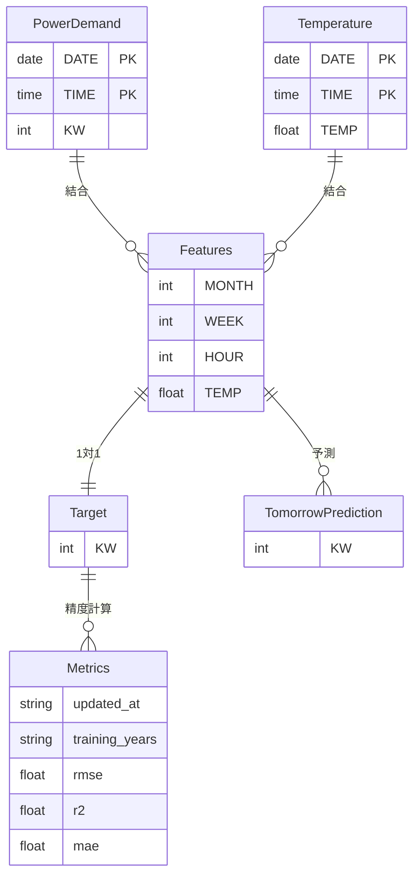

# データモデル仕様書: 電力需要予測システム

**作成日**: 2025年11月26日
**バージョン**: 1.0.0
**関連仕様書**: [spec.md](https://github.com/J1921604/Power-Demand-Forecast/blob/main/specs/001-Power-Demand-Forecast/spec.md), [plan.md](https://github.com/J1921604/Power-Demand-Forecast/blob/main/specs/001-Power-Demand-Forecast/plan.md)

## 概要

本ドキュメントは、電力需要予測システムで使用するデータモデル（エンティティ、特徴量、目的変数）の詳細仕様を定義します。

## エンティティ定義

### 1. 電力需要データ（PowerDemand）

**ファイル名**: `juyo-YYYY.csv`（年ごと）

| カラム名 | データ型 | NULL許可 | 説明                   | 制約                | 例         |
| -------- | -------- | -------- | ---------------------- | ------------------- | ---------- |
| DATE     | Date     | No       | 日付                   | YYYY-MM-DD形式      | 2024-01-01 |
| TIME     | Time     | No       | 時刻                   | HH:MM形式（24時間） | 00:00      |
| KW       | Integer  | No       | 電力需要（キロワット） | > 0                 | 150000     |

**主キー**: (DATE, TIME)
**インデックス**: DATE
**サンプルデータ**:

```csv
DATE,TIME,KW
2024-01-01,00:00,150000
2024-01-01,01:00,140000
2024-01-01,02:00,130000
```

**データソース**: TEPCOでんき予報（手動取得・CSV化）

---

### 2. 気温データ（Temperature）

**ファイル名**: `temperature-YYYY.csv`（年ごと）

| カラム名 | データ型 | NULL許可 | 説明       | 制約           | 例         |
| -------- | -------- | -------- | ---------- | -------------- | ---------- |
| DATE     | Date     | No       | 日付       | YYYY-MM-DD形式 | 2024-01-01 |
| TIME     | Time     | No       | 時刻       | HH:MM形式      | 00:00      |
| TEMP     | Float    | No       | 気温（℃） | -50 ~ 50       | 12.5       |

**主キー**: (DATE, TIME)
**インデックス**: DATE
**サンプルデータ**:

```csv
DATE,TIME,TEMP
2024-01-01,00:00,12.5
2024-01-01,01:00,12.3
2024-01-01,02:00,12.0
```

**データソース**: Open-Meteo API（自動取得）

---

### 3. 特徴量データ（Features）

**ファイル名**: `X.csv`, `Xtrain.csv`, `Xtest.csv`

| カラム名 | データ型 | NULL許可 | 説明         | 制約 | 例   |
| -------- | -------- | -------- | ------------ | ---- | ---- |
| MONTH    | Integer  | No       | 月（1-12）   | 1-12 | 1    |
| WEEK     | Integer  | No       | 曜日（0-6）  | 0-6  | 0    |
| HOUR     | Integer  | No       | 時刻（0-23） | 0-23 | 0    |
| TEMP     | Float    | No       | 気温（℃）   | -    | 12.5 |

**行数**: 電力需要データと気温データの結合結果（時刻単位）
**サンプルデータ**:

```csv
MONTH,WEEK,HOUR,TEMP
1,0,0,12.5
1,0,1,12.3
1,0,2,12.0
```

**生成ロジック**:

```python
# data.pyで生成
df['MONTH'] = df['DATE'].dt.month
df['WEEK'] = df['DATE'].dt.dayofweek
df['HOUR'] = df['TIME'].dt.hour
df['TEMP'] = df['TEMP']  # 気温データから取得
```

---

### 3.1. 翌日予測用特徴量データ（TomorrowFeatures）

**ファイル名**: `tomorrow/tomorrow.csv`

翌日予測で使用する特徴量（過去7日 + 未来7日）を、学習時の特徴量スキーマと同一形式で保存します。

| カラム名 | データ型 | NULL許可 | 説明         | 制約 | 例   |
| -------- | -------- | -------- | ------------ | ---- | ---- |
| MONTH    | Integer  | No       | 月（1-12）   | 1-12 | 1    |
| WEEK     | Integer  | No       | 曜日（0-6）  | 0-6  | 2    |
| HOUR     | Integer  | No       | 時刻（0-23） | 0-23 | 0    |
| TEMP     | Float    | No       | 気温（℃）   | -    | 2.9  |

**行数**: 336行（過去7日168時間 + 未来7日168時間）

**列順（重要）**: `MONTH,WEEK,HOUR,TEMP`

> 注: 予測実装はCSVをそのままnumpy配列に変換してスケーラー/モデルに入力するため、列順のズレは精度を致命的に悪化させます。

---

### 4. 目的変数データ（Target）

**ファイル名**: `Y.csv`, `Ytrain.csv`, `Ytest.csv`

| カラム名 | データ型 | NULL許可 | 説明                   | 制約 | 例     |
| -------- | -------- | -------- | ---------------------- | ---- | ------ |
| KW       | Integer  | No       | 電力需要（キロワット） | > 0  | 150000 |

**行数**: 特徴量データと同じ（1対1対応）
**サンプルデータ**:

```csv
KW
150000
140000
130000
```

---

### 5. 翌日予測データ（TomorrowPrediction）

**ファイル名**: `{model}_tomorrow.csv`（モデル別）

| カラム名 | データ型 | NULL許可 | 説明                       | 制約 | 例     |
| -------- | -------- | -------- | -------------------------- | ---- | ------ |
| KW       | Integer  | No       | 予測電力需要（キロワット） | > 0  | 155000 |

**行数**: 336行（過去7日168時間 + 予測7日168時間）
**サンプルデータ**:

```csv
KW
155000
145000
135000
```

---

### 6. 精度指標データ（Metrics）

**ファイル名**: `metrics.json`

```json
{
  "updated_at": "2025-12-04T12:00:00Z",
  "training_years": "2022,2023,2024",
  "lightgbm": {
    "rmse": 450.5,
    "r2": 0.92,
    "mae": 350.2
  },
  "keras": {
    "rmse": 480.3,
    "r2": 0.89,
    "mae": 380.5
  },
  "randomforest": {
    "rmse": 520.1,
    "r2": 0.87,
    "mae": 410.3
  },
  "pycaret": {
    "rmse": 470.2,
    "r2": 0.90,
    "mae": 370.8
  }
}
```

**フィールド説明**:

- `updated_at`: 更新日時（ISO 8601形式）
- `training_years`: 学習年（カンマ区切り）
- `{model}.rmse`: 平均二乗誤差（kW）
- `{model}.r2`: 決定係数（0~1）
- `{model}.mae`: 平均絶対誤差（kW）

---

## データフローダイアグラム



---

## データ整合性制約

### 1. 時刻単位の一致

電力需要データと気温データは、DATE + TIMEの組み合わせで一致する必要があります。

**検証SQL（SQLite）**:

```sql
SELECT COUNT(*) FROM PowerDemand
WHERE NOT EXISTS (
  SELECT 1 FROM Temperature
  WHERE PowerDemand.DATE = Temperature.DATE
    AND PowerDemand.TIME = Temperature.TIME
);
-- 結果は0であるべき
```

**Python検証**:

```python
power_df = pd.read_csv('juyo-2024.csv')
temp_df = pd.read_csv('temperature-2024.csv')

merged = power_df.merge(temp_df, on=['DATE', 'TIME'], how='inner')
assert len(merged) == len(power_df), "気温データが不足しています"
```

---

### 2. 特徴量と目的変数の行数一致

X.csvとY.csvは常に同じ行数である必要があります。

**検証**:

```python
X = pd.read_csv('X.csv')
Y = pd.read_csv('Y.csv')
assert len(X) == len(Y), "特徴量と目的変数の行数が一致しません"
```

---

### 3. 欠損値の禁止

すべてのカラムはNULL値を許可しません。

**検証**:

```python
df = pd.read_csv('X.csv')
assert df.isna().sum().sum() == 0, "欠損値が存在します"
```

---

## データ変換ルール

### 1. 曜日変換（WEEK）

| 曜日   | 値 |
| ------ | -- |
| 月曜日 | 0  |
| 火曜日 | 1  |
| 水曜日 | 2  |
| 木曜日 | 3  |
| 金曜日 | 4  |
| 土曜日 | 5  |
| 日曜日 | 6  |

**Python実装**:

```python
df['WEEK'] = pd.to_datetime(df['DATE']).dt.dayofweek
```

---

### 2. 標準化（Standardization）

**特徴量のみ**標準化を適用します（目的変数は標準化しない）。

**公式**:

$$
X_{\text{scaled}} = \frac{X - \mu}{\sigma}
$$

**Python実装**:

```python
from sklearn.preprocessing import StandardScaler

scaler = StandardScaler()
X_scaled = scaler.fit_transform(X)
```

---

## ストレージ仕様

### ファイル配置

```
AI/
├── data/
│   ├── juyo-2016.csv ~ juyo-2025.csv       # 電力需要データ
│   ├── temperature-2016.csv ~ temperature-2024.csv  # 気温データ
│   ├── X.csv, Y.csv                        # 統合データ
│   ├── Xtrain.csv, Ytrain.csv              # 訓練データ
│   └── Xtest.csv, Ytest.csv                # テストデータ
├── train/
│   └── {model}/
│       ├── {model}_model.sav / .h5         # 学習済みモデル
│       └── {model}_Ypred.csv               # 訓練時予測結果
└── tomorrow/
    ├── tomorrow.csv                        # 翌日気温データ
    ├── Ytest.csv                           # 翌日実績データ
    └── {model}/
        ├── {model}_tomorrow.csv            # 翌日予測結果
        └── {model}_tomorrow.png            # 翌日予測グラフ
```

---

### ファイルサイズ見積もり

| ファイル種別         | 1年あたり行数 | 1行サイズ | 1年あたりサイズ | 10年合計 |
| -------------------- | ------------- | --------- | --------------- | -------- |
| juyo-YYYY.csv        | 8,760         | 30 bytes  | 260 KB          | 2.6 MB   |
| temperature-YYYY.csv | 8,760         | 30 bytes  | 260 KB          | 2.6 MB   |
| X.csv                | 87,600        | 20 bytes  | 1.7 MB          | 1.7 MB   |
| Y.csv                | 87,600        | 10 bytes  | 876 KB          | 876 KB   |
| {model}_model.sav    | -             | -         | 1-10 MB         | 40 MB    |

**合計**: 約50MB（GitHub Pages制限内）

---

## バリデーションルール

### 1. 電力需要値の妥当性

```python
assert (df['KW'] > 0).all(), "電力需要は0より大きい必要があります"
assert (df['KW'] < 1000000).all(), "電力需要が異常に大きいです"
```

### 2. 気温値の妥当性

```python
assert (df['TEMP'] > -50).all(), "気温が異常に低いです"
assert (df['TEMP'] < 50).all(), "気温が異常に高いです"
```

### 3. 日付形式の妥当性

```python
df['DATE'] = pd.to_datetime(df['DATE'], format='%Y-%m-%d', errors='coerce')
assert df['DATE'].isna().sum() == 0, "無効な日付形式が存在します"
```

---

**最終更新**: 2025年11月26日
