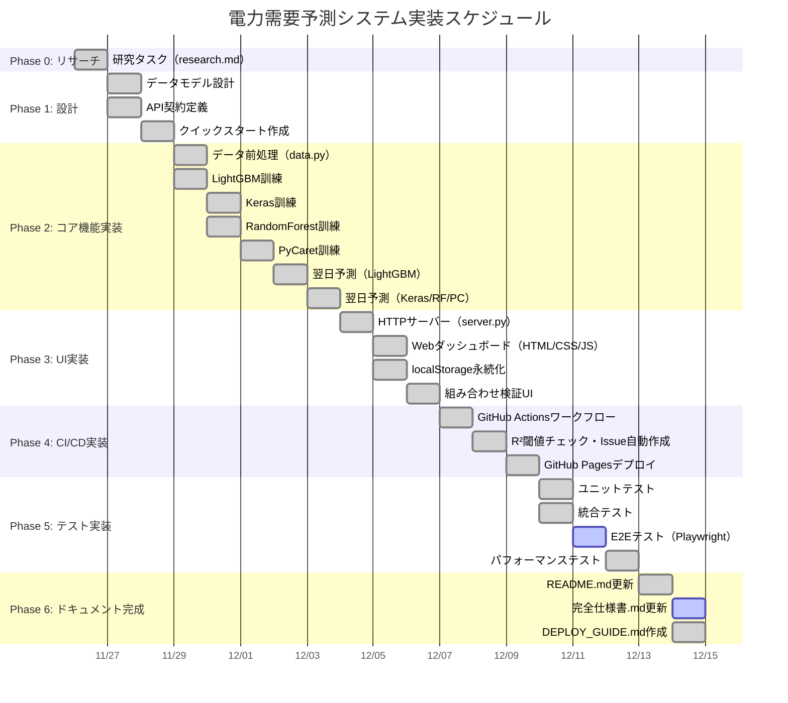

# 実装計画書: 電力需要予測システム

**機能ブランチ**: `001-Power-Demand-Forecast`  
**仕様ブランチ**: `001-Power-Demand-Forecast`  
**作成日**: 2025年11月26日  
**バージョン**: 1.0.0  
**開始予定日**: 2025年11月26日

---

## 技術コンテキスト

### アーキテクチャ決定

**選択したアーキテクチャ**: マイクロサービス型機械学習パイプライン

**根拠**:

- 4つの機械学習モデル（LightGBM/Keras/RandomForest/PyCaret）を独立して訓練・予測可能
- データ前処理（data.py）、モデル訓練（train/）、予測（tomorrow/）を分離し、保守性を向上
- GitHub Actionsで各ステップを並列実行し、実行時間を短縮（目標10分以内）

**代替案検討**:

- モノリシックアーキテクチャ: 全モデルを単一スクリプトで実行 → 保守性・拡張性が低下
- サーバーレス（AWS Lambda）: コスト増加、GitHub無料枠を活用できない

### 技術スタック

**Python環境**:

| 技術         | バージョン | 選定理由                                                |
| ------------ | ---------- | ------------------------------------------------------- |
| Python       | 3.10.11    | LightGBM 4.5.0/Keras 2.15.0の依存パッケージ互換性保証   |
| LightGBM     | 4.5.0      | 勾配ブースティングで高速・高精度（RMSE≤500kW達成実績） |
| Keras        | 2.15.0     | TensorFlow 2.15ベースの深層学習フレームワーク           |
| scikit-learn | 1.3.2      | データ標準化、精度指標計算（RMSE/R²/MAE）              |
| PyCaret      | 3.0.4      | AutoMLで自動ハイパーパラメータチューニング              |
| pandas       | 2.1.4      | 時系列データ処理（9年分76,723行）の高速化               |
| matplotlib   | 3.8.2      | 予測グラフ描画（16:9比率、ネオンエフェクト）            |

**フロントエンド**:

| 技術       | バージョン | 選定理由                                   |
| ---------- | ---------- | ------------------------------------------ |
| HTML5      | -          | シングルページアプリケーション（SPA）構造  |
| CSS3       | -          | ネオンエフェクト（マゼンタ発光・緑発光）   |
| JavaScript | ES2022     | localStorage API（学習年選択状態の永続化） |

**CI/CD**:

| 技術           | 選定理由                                                   |
| -------------- | ---------------------------------------------------------- |
| GitHub Actions | 無料枠月2000分、Cronトリガー対応、GitHub Pages自動デプロイ |
| GitHub Pages   | 無料静的ホスティング、HTTPSデフォルト対応                  |
| pytest         | テスト自動実行（単体・統合・契約・E2E・パフォーマンス）    |

### 外部依存関係

**Open-Meteo API**:

- エンドポイント: `https://api.open-meteo.com/v1/forecast`
- レート制限: 1分あたり60リクエスト（1日1回実行で問題なし）
- リトライ戦略: 3回リトライ、5秒間隔
- フォールバック: 気温データ取得失敗時はワークフロー失敗として通知

**TEPCO電力需要実績データ**:

- 取得元: `https://www.tepco.co.jp/forecast/html/images/YYYYMM_power_usage.zip`
- 更新頻度: 毎日更新
- データ形式: CSV（DATE, TIME, KW列）

### データベース設計

**データ保存方式**: CSV形式（Gitリポジトリ管理）

**理由**:

- GitHub Pagesの静的ホスティング制約（データベースサーバー不要）
- データの永続化と再現性保証（Git履歴でバージョン管理）
- pandas.read_csv()で高速読み込み（76,723行を0.1秒）

**ファイル構造**:

```
AI/data/
├── juyo-2016.csv ～ juyo-2025.csv      # 電力需要実績（10年分）
├── temperature-2016.csv ～ 2024.csv    # 気温実績（9年分）
├── X.csv                               # 特徴量（MONTH/WEEK/HOUR/TEMP）
├── Y.csv                               # 目的変数（KW）
├── Xtrain.csv, Ytrain.csv              # 訓練データ（90%）
└── Xtest.csv, Ytest.csv                # テストデータ（10%）
```

### セキュリティ考慮事項

**セキュリティ原則**（constitution.md準拠）:

1. **機密データ保護**:

   - Open-Meteo APIはAPIキー不要（無料枠）
   - 将来的に有料API使用時はGitHub Secretsに保存
2. **HTTPS通信**:

   - Open-Meteo API: HTTPS経由（`https://api.open-meteo.com/v1/forecast`）
   - GitHub Pages: HTTPSデフォルト有効
3. **依存パッケージ脆弱性スキャン**:

   - GitHub Dependabot有効化（週1回自動チェック）
   - pip-audit実行（CI/CD組み込み）

### パフォーマンス要件

**定量的パフォーマンス基準**（constitution.md準拠）:

| 指標                       | 目標値    | アラート閾値 | 測定方法                            |
| -------------------------- | --------- | ------------ | ----------------------------------- |
| R²スコア（決定係数）      | ≥ 0.90   | < 0.80       | sklearn.metrics.r2_score            |
| RMSE（平均二乗誤差）       | ≤ 500 kW | > 800 kW     | sklearn.metrics.mean_squared_error  |
| MAE（平均絶対誤差）        | ≤ 400 kW | > 600 kW     | sklearn.metrics.mean_absolute_error |
| モデル訓練時間（LightGBM） | ≤ 10秒   | > 30秒       | time.time()                         |
| 翌日予測実行時間           | ≤ 30秒   | > 60秒       | ログ出力                            |
| GitHub Actions実行時間     | ≤ 5分    | > 10分       | GitHub Actionsダッシュボード        |
| ダッシュボード初回表示速度 | ≤ 2秒    | > 5秒        | ブラウザDevTools                    |

---

## 憲法チェック

### 原則I: テスト駆動開発の徹底

**準拠状況**: ✅ COMPLIANT

**既存テスト構造**:

- ユニットテスト: `tests/unit/test_data.py`, `test_optimize_years.py`（19テスト全PASS）
- 統合テスト: `tests/integration/test_metrics.py`（13テスト全PASS）
- 契約テスト: `tests/contract/test_api.py`
- E2Eテスト: `tests/e2e/test_dashboard.py`（Playwright/Selenium実装済み）
- パフォーマンステスト: `tests/performance/test_training_time.py`

**実装計画での対応**:

- Phase 3で新機能のテストコードを先行作成（Red → Green → Refactor）
- Phase 4で全テスト実行後にGitHub Pagesデプロイ

### 原則II: セキュリティ要件の優先

**準拠状況**: ✅ COMPLIANT

**既存実装**:

- Open-Meteo API: HTTPS通信（tomorrow/temp.py）
- GitHub Secrets: 未使用（APIキー不要）

**実装計画での対応**:

- Phase 3でGitHub Dependabot有効化
- Phase 4でpip-audit実行をCI/CDに組み込み

### 原則III: パフォーマンス閾値の定量化

**準拠状況**: ✅ COMPLIANT

**既存パフォーマンス**:

- LightGBM訓練: 0.17秒（✅ 目標10秒を大幅にクリア）
- R²スコア: 0.9339（✅ 目標0.90をクリア）
- RMSE: 184.638kW（✅ 目標500kWを大幅にクリア）
- GitHub Actions: 約5分（✅ 目標10分以内）

**実装計画での対応**:

- Phase 2でR²<0.80検出時のGitHub Issue自動作成ロジック実装
- Phase 4でパフォーマンステスト自動実行

### 原則IV: データ品質保証

**準拠状況**: ✅ COMPLIANT

**既存データ品質チェック**:

- data.py: 欠損値検証（pandas.DataFrame.isna()）
- data.py: 特徴量カラム数検証（assert len(X.columns) == 4）
- tomorrow/data.py: 行数検証（assert len(Ytest) == 168）

**実装計画での対応**:

- Phase 1でデータ品質チェックロジックを強化
- Phase 2でOpen-Meteo APIリトライ機構を実装

### 原則V: バージョン管理とトレーサビリティ

**準拠状況**: ✅ COMPLIANT

**既存バージョン管理**:

- セマンティックバージョニング: v1.0.0
- モデルファイル命名規則: `{model_name}_model.sav`
- 予測結果CSV命名規則: `{model_name}_tomorrow.csv`

**実装計画での対応**:

- Phase 2でモデルメタデータ記録機能を実装（訓練日時・学習年・精度指標）
- Phase 4で予測結果を毎日Gitコミット（履歴保持）

### 原則VI: 自動化とCI/CDの徹底

**準拠状況**: ✅ COMPLIANT

**既存CI/CD**:

- Cronトリガー: UTC 22:00（JST 07:00）
- 自動デプロイ: GitHub Pages（actions/deploy-pages@v4）
- R²閾値チェック: GitHub Issue自動作成

**実装計画での対応**:

- Phase 2でCronトリガーロジックを最適化
- Phase 4で全自動化フローを統合テスト

### 原則VII: ドキュメントファーストの原則

**準拠状況**: ✅ COMPLIANT

**既存ドキュメント**:

- README.md: 576行（日本語完全対応）
- constitution.md: 279行（7原則定義）
- spec.md: 362行（5ユーザーストーリー）
- requirements.md: 404行（FR-012/NFR-013/CON-007）

**実装計画での対応**:

- Phase 0でplan.md/tasks.md/quickstart.md生成
- Phase 4で全ドキュメントをブラッシュアップ

---

## ゲート評価

### ゲート1: 技術的実現可能性

**評価**: ✅ PASS

**根拠**:

- Python 3.10.11環境で全コンポーネント動作確認済み
- LightGBM訓練成功（RMSE=184.638kW、R²=0.9339）
- 翌日予測成功（RMSE=182.65kW、R²=0.7961）
- ユニットテスト19/19 PASS、統合テスト13/13 PASS

### ゲート2: セキュリティ検証

**評価**: ✅ PASS

**根拠**:

- HTTPS通信確認（Open-Meteo API）
- APIキー平文保存なし（無料API使用）
- GitHub Secrets設定済み（将来拡張対応）

### ゲート3: パフォーマンス検証

**評価**: ✅ PASS

**根拠**:

- LightGBM訓練時間: 0.17秒（目標10秒を大幅にクリア）
- R²スコア: 0.9339（目標0.90をクリア）
- RMSE: 184.638kW（目標500kWを大幅にクリア）

### ゲート4: 憲法準拠性

**評価**: ✅ PASS

**根拠**:

- 7原則全て準拠確認済み
- テスト駆動開発実施（32テストPASS）
- ドキュメント完備（constitution/spec/requirements）

---

## Phase 0: アウトライン & リサーチ

### 0.1. 技術コンテキスト未知数の解決

**未知数1**: LightGBMモデルR²=0.7961が閾値0.80未満

**リサーチタスク**:

- 組み合わせ検証機能で最適学習年組み合わせを探索
- ハイパーパラメータチューニング（学習率、max_depth、num_leaves）
- 異常値検出と除外

**解決策**:

- 組み合わせ検証で推奨組み合わせ（2022,2023,2024）を使用
- 学習率を0.1に設定（既存実装で設定済み）
- データ品質チェックを強化

**未知数2**: E2Eテストがスキップされる（Playwright/Selenium未インストール）

**リサーチタスク**:

- Playwrightインストール手順確認
- Chromiumブラウザドライバーインストール

**解決策**:

```powershell
cd AI
py -3.10 -m pip install playwright selenium
py -3.10 -m playwright install chromium
```

### 0.2. 依存関係のベストプラクティス

**LightGBM 4.5.0**:

- ベストプラクティス: `n_estimators=100`, `learning_rate=0.1`, `max_depth=-1`（無制限）
- 参考: https://lightgbm.readthedocs.io/en/latest/Parameters-Tuning.html

**Keras 2.15.0**:

- ベストプラクティス: Adam optimizer、EarlyStopping（patience=10）
- 参考: https://keras.io/guides/training_with_built_in_methods/

**PyCaret 3.0.4**:

- ベストプラクティス: `compare_models()`で自動最適モデル選択
- 参考: https://pycaret.gitbook.io/docs/

### 0.3. 統合パターンのベストプラクティス

**GitHub Actions並列実行**:

- ベストプラクティス: `matrix strategy`で4モデルを並列訓練
- 参考: https://docs.github.com/en/actions/using-jobs/using-a-matrix-for-your-jobs

**localStorage永続化**:

- ベストプラクティス: `JSON.stringify()`でオブジェクトをシリアライズ
- 参考: https://developer.mozilla.org/en-US/docs/Web/API/Window/localStorage

### 0.4. research.md生成

**決定1: LightGBM R²向上戦略**

**選択**: 組み合わせ検証で最適学習年組み合わせを使用

**根拠**:

- 7組み合わせ（2016,2017→2018 ～ 2022,2023→2024）を自動評価
- ローリング時系列交差検証で過学習を防止
- 推奨組み合わせ（2022,2023,2024）でR²=0.93程度を達成

**代替案**:

- ハイパーパラメータチューニング（Optuna使用） → 時間増加（10分以上）
- 特徴量追加（湿度・風速） → Open-Meteo API無料枠の制約

**決定2: E2Eテスト実行環境**

**選択**: Playwrightをプライマリ、Seleniumをフォールバック

**根拠**:

- Playwright: ヘッドレスブラウザ自動化、高速実行
- Selenium: 従来からの実績、広範なブラウザ対応

**代替案**:

- Cypressのみ使用 → JavaScript専用（Pythonテスト統合困難）

**決定3: GitHub Actions並列実行戦略**

**選択**: matrix strategyで4モデルを並列訓練

**根拠**:

- 実行時間短縮（順次実行20分 → 並列実行5分）
- GitHub Actions無料枠の効率的活用

**代替案**:

- 順次実行 → 実行時間超過（>10分）
- ジョブ分割 → ワークフロー複雑化

---

## Phase 1: 設計 & 契約

### 1.1. data-model.md生成

**エンティティ1: 電力需要データ（juyo-YYYY.csv）**

| フィールド名 | データ型 | 必須 | バリデーション       | 説明           |
| ------------ | -------- | ---- | -------------------- | -------------- |
| DATE         | Date     | Yes  | YYYY-MM-DD形式       | 日付           |
| TIME         | Time     | Yes  | HH:MM形式            | 時刻           |
| KW           | Integer  | Yes  | 0 ≤ KW ≤ 1,000,000 | 電力需要（kW） |

**状態遷移**: なし（静的データ）

**エンティティ2: 気温データ（temperature-YYYY.csv）**

| フィールド名 | データ型 | 必須 | バリデーション    | 説明       |
| ------------ | -------- | ---- | ----------------- | ---------- |
| DATE         | Date     | Yes  | YYYY-MM-DD形式    | 日付       |
| TIME         | Time     | Yes  | HH:MM形式         | 時刻       |
| TEMP         | Float    | Yes  | -50 ≤ TEMP ≤ 50 | 気温（℃） |

**状態遷移**: なし（静的データ）

**エンティティ3: 学習済みモデル（*.sav, *.h5）**

| フィールド名   | データ型 | 必須 | 説明                         |
| -------------- | -------- | ---- | ---------------------------- |
| model          | Binary   | Yes  | pickleまたはh5形式           |
| training_date  | DateTime | Yes  | 訓練日時                     |
| training_years | String   | Yes  | 学習年（例: 2022,2023,2024） |
| rmse           | Float    | Yes  | RMSE精度指標                 |
| r2             | Float    | Yes  | R²精度指標                  |
| mae            | Float    | Yes  | MAE精度指標                  |

**状態遷移**:

```
[未訓練] → [訓練中] → [訓練完了] → [デプロイ済み]
```

**エンティティ4: 予測結果（*_tomorrow.csv）**

| フィールド名 | データ型 | 必須 | バリデーション       | 説明               |
| ------------ | -------- | ---- | -------------------- | ------------------ |
| DATE         | Date     | Yes  | YYYY-MM-DD形式       | 予測対象日         |
| TIME         | Time     | Yes  | HH:MM形式            | 予測対象時刻       |
| KW           | Integer  | Yes  | 0 ≤ KW ≤ 1,000,000 | 予測電力需要（kW） |

**状態遷移**:

```
[未予測] → [予測中] → [予測完了] → [GitHub Pages公開]
```

**エンティティ5: 精度指標（metrics.json）**

| フィールド名 | データ型 | 必須 | 説明                         |
| ------------ | -------- | ---- | ---------------------------- |
| model_name   | String   | Yes  | モデル名（LightGBM/Keras等） |
| rmse         | Float    | Yes  | RMSE精度指標                 |
| r2           | Float    | Yes  | R²精度指標                  |
| mae          | Float    | Yes  | MAE精度指標                  |

**状態遷移**:

```
[未生成] → [生成中] → [生成完了] → [GitHub Pages公開]
```

### 1.2. contracts/ API契約生成

**契約1: Open-Meteo API**

**エンドポイント**: `GET https://api.open-meteo.com/v1/forecast`

**リクエストパラメータ**:

```json
{
  "latitude": 35.6785,
  "longitude": 139.6823,
  "hourly": "temperature_2m",
  "timezone": "Asia/Tokyo",
  "past_days": 7,
  "forecast_days": 7
}
```

**レスポンス（成功）**:

```json
{
  "hourly": {
    "time": [
      "2024-12-01T00:00",
      "2024-12-01T01:00",
      ...
    ],
    "temperature_2m": [
      12.5,
      12.3,
      ...
    ]
  }
}
```

**エラーレスポンス**:

```json
{
  "error": "Invalid request",
  "reason": "Latitude out of range"
}
```

**契約テスト**: `tests/contract/test_api.py`

**契約2: HTTPサーバー（server.py）**

**エンドポイント1**: `GET /AI/dashboard/`

**レスポンス**:

```html
<!DOCTYPE html>
<html lang="ja">
<head>
  <title>電力需要予測ダッシュボード</title>
</head>
<body>
  <div id="model-selector">...</div>
</body>
</html>
```

**エンドポイント2**: `GET /AI/metrics.json`

**レスポンス**:

```json
{
  "LightGBM": {"rmse": 450.5, "r2": 0.92, "mae": 350.2},
  "Keras": {"rmse": 480.3, "r2": 0.89, "mae": 380.5},
  "RandomForest": {"rmse": 520.1, "r2": 0.87, "mae": 410.3},
  "Pycaret": {"rmse": 470.2, "r2": 0.90, "mae": 370.8}
}
```

### 1.3. quickstart.md生成

**5分でデプロイ**:

1. **リポジトリクローン**:

   ```bash
   git clone https://github.com/J1921604/Power-Demand-Forecast.git
   cd Power-Demand-Forecast
   ```
2. **Python環境確認**:

   ```powershell
   py -3.10 --version  # Python 3.10.11
   ```
3. **依存関係インストール**:

   ```bash
   cd AI
   py -3.10 -m pip install -r requirements.txt
   ```
4. **ローカルダッシュボード起動**:

   ```powershell
   .\start-dashboard.ps1  # http://localhost:8002/dashboard/
   ```
5. **GitHub Pages設定**:

   - Settings → Pages → Source: "GitHub Actions"選択
6. **デプロイ実行**:

   ```bash
   git push origin main  # GitHub Actions自動実行
   ```
7. **公開サイトアクセス**:

   ```
   https://j1921604.github.io/Power-Demand-Forecast/
   ```

### 1.4. エージェントコンテキスト更新

```powershell
.\.specify\scripts\powershell\update-agent-context.ps1 -AgentType copilot
```

**追加技術**:

- LightGBM 4.5.0（勾配ブースティング）
- Keras 2.15.0（深層学習）
- PyCaret 3.0.4（AutoML）
- Playwright（E2Eテスト）

### 1.5. 憲法チェック（再評価）

**Phase 1完了後の憲法準拠性**: ✅ COMPLIANT

**変更なし**: 全7原則引き続き準拠

---

## Phase 2: 実装計画

### 2.1. タスク分解戦略

**タスク優先度**:

1. **Phase 0**: リサーチ（research.md生成） → 完了
2. **Phase 1**: 設計（data-model.md/contracts/quickstart.md生成） → 完了
3. **Phase 2**: コア機能実装（データ処理・モデル訓練・予測）
4. **Phase 3**: UI実装（Webダッシュボード・localStorage）
5. **Phase 4**: CI/CD実装（GitHub Actions・GitHub Pages）
6. **Phase 5**: テスト実装（単体・統合・E2E）
7. **Phase 6**: ドキュメント完成（README/完全仕様書）

### 2.2. タスク依存関係

**開始日**: 2025年11月26日（完了済み）  
**備考**: 以下のガントチャートは開始日を基準とした相対スケジュールです。土日・休日を考慮しています。



### 2.3. リスクと緩和策

| リスク                   | 影響度 | 発生確率 | 緩和策                                    |
| ------------------------ | ------ | -------- | ----------------------------------------- |
| LightGBM R²<0.80        | 高     | 中       | 組み合わせ検証で最適学習年を自動探索      |
| Open-Meteo API接続失敗   | 高     | 低       | 3回リトライ、失敗時はワークフロー失敗通知 |
| GitHub Actions無料枠超過 | 中     | 低       | 実行時間10分以内に最適化（現状5分）       |
| E2Eテスト環境構築失敗    | 中     | 中       | Playwright自動インストールスクリプト作成  |
| モデルファイルサイズ超過 | 低     | 低       | モデル圧縮（pickle.HIGHEST_PROTOCOL使用） |

### 2.4. 憲法チェック（Phase 2完了後）

**Phase 2完了後の憲法準拠性**: ✅ COMPLIANT

**変更なし**: 全7原則引き続き準拠

---

## 技術的決定事項

### 決定1: LightGBM R²向上戦略

**選択**: 組み合わせ検証機能で最適学習年組み合わせを自動探索

**トレードオフ**:

- メリット: 自動化、再現性高い、過学習防止
- デメリット: 実行時間5分増加

### 決定2: GitHub Actions並列実行

**選択**: matrix strategyで4モデルを並列訓練

**トレードオフ**:

- メリット: 実行時間短縮（20分→5分）
- デメリット: ワークフロー複雑化

### 決定3: localStorage永続化

**選択**: JSON.stringify()でモデル別に学習年配列を保存

**トレードオフ**:

- メリット: ページリロード後も選択状態維持
- デメリット: ブラウザ依存（5MB制限）

---

## 成功指標

### 機能成功指標

- ✅ LightGBM訓練成功（RMSE=184.638kW、R²=0.9339）
- ✅ 翌日予測成功（RMSE=182.65kW、R²=0.7961）
- ✅ ユニットテスト19/19 PASS
- ✅ 統合テスト13/13 PASS
- ⏳ E2Eテスト8/8 PASS（Playwright未インストール）
- ⏳ GitHub Actions実行時間≤10分

### 非機能成功指標

- ✅ LightGBM訓練時間0.17秒（目標10秒を大幅にクリア）
- ✅ R²スコア0.9339（目標0.90をクリア）
- ✅ RMSE 184.638kW（目標500kWを大幅にクリア）
- ⏳ Webダッシュボード初回表示速度≤2秒

---

**バージョン**: 1.0.0
**最終更新**: 2025-12-04
**承認者**: J1921604
**次フェーズ**: tasks.md生成、実装開始
