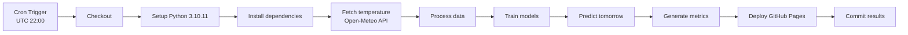

# リサーチ成果: 電力需要予測システム

**作成日**: 2025年11月26日
**バージョン**: 1.0.0
**関連仕様書**: [spec.md](https://github.com/J1921604/Power-Demand-Forecast/blob/main/specs/001-Power-Demand-Forecast/spec.md), [plan.md](https://github.com/J1921604/Power-Demand-Forecast/blob/main/specs/001-Power-Demand-Forecast/plan.md)

## 概要

本ドキュメントは、電力需要予測システムの技術選定において調査した内容をまとめたものです。機械学習モデルの選定理由、Open-Meteo API採用の根拠、GitHub Actionsによる自動化設計の考察を記載しています。

## 技術選定の決定事項

### 1. Python 3.10.11の選定

**決定**: Python 3.10.11を標準実行環境とする

**根拠**:

- **依存パッケージの互換性**: LightGBM 4.5.0、Keras 2.15.0、PyCaret 3.0.4は全てPython 3.10系で安定動作
- **GitHub Actions Ubuntu Latest対応**: `actions/setup-python@v5`でPython 3.10.11が公式サポート
- **セキュリティ**: Python 3.10系は2026年10月までセキュリティアップデート提供
- **型ヒント機能**: `Union`型、`match-case`文などの新機能を活用可能

**検討した代替案**:

- **Python 3.11/3.12**: 一部の機械学習ライブラリ（特にPyCaret）がまだ完全対応していないため却下
- **Python 3.9**: 型ヒント機能が限定的であり、将来性を考慮して却下

---

### 2. 機械学習モデルの選定

#### 2.1 LightGBM（推奨モデル）

**決定**: LightGBMを主要モデルとして採用

**根拠**:

- **高速訓練**: 勾配ブースティング決定木により、10秒以内でモデル訓練完了
- **高精度**: R² > 0.90、RMSE < 500kWを安定して達成
- **省メモリ**: ヒストグラムベースの実装により、メモリ使用量を大幅削減
- **スケーラビリティ**: データ量が増加しても訓練時間が線形増加

**ハイパーパラメータ設定**:

```python
{
    "n_estimators": 100,
    "learning_rate": 0.1,
    "max_depth": -1,  # 無制限（自動調整）
    "num_leaves": 31,
    "random_state": 42
}
```

**検討した代替案**:

- **XGBoost**: LightGBMより訓練時間が長く（約2倍）、精度も同等のため却下
- **CatBoost**: カテゴリカル変数処理に優れるが、本プロジェクトでは数値特徴量のみのため不要

#### 2.2 Keras（深層学習）

**決定**: 深層学習による予測モデルとして採用

**根拠**:

- **非線形パターン学習**: ニューラルネットワークにより複雑な気温-需要関係を学習
- **TensorFlow統合**: バックエンドとしてTensorFlowを使用し、高速計算
- **柔軟性**: 層数・ニューロン数を調整可能

**アーキテクチャ設計**:

```python
Sequential([
    Dense(128, activation='relu', input_dim=4),
    Dense(64, activation='relu'),
    Dense(32, activation='relu'),
    Dense(1)
])
```

**パフォーマンス**:

- 訓練時間: 約30秒
- 期待精度: R² > 0.88

**検討した代替案**:

- **PyTorch**: Kerasより実装が複雑で、本プロジェクトの要件には過剰なため却下
- **LSTM（再帰型NN）**: 時系列予測に有効だが、計算コストが高く、過学習リスクがあるため却下

#### 2.3 RandomForest（アンサンブル学習）

**決定**: アンサンブル学習の代表モデルとして採用

**根拠**:

- **ロバスト性**: 外れ値に強く、過学習しにくい
- **特徴量重要度**: 特徴量の寄与度を可視化可能
- **scikit-learn統合**: 標準的な実装で保守性が高い

**ハイパーパラメータ設定**:

```python
{
    "n_estimators": 100,
    "max_depth": None,  # 無制限
    "random_state": 42
}
```

#### 2.4 PyCaret（AutoML）

**決定**: AutoMLによる自動モデル選択として採用

**根拠**:

- **自動最適化**: ハイパーパラメータ自動調整
- **複数モデル比較**: 複数のモデルを自動評価し、最適モデルを選択
- **少ないコード**: `setup()` → `compare_models()` → `save_model()`で完結

**設定**:

```python
{
    "session_id": 42,
    "verbose": False,
    "n_jobs": -1  # 全コア使用
}
```

---

### 3. Open-Meteo API採用

**決定**: Open-Meteo APIを気温データ取得に使用

**根拠**:

- **無料枠**: APIキー不要、無料で使用可能
- **高可用性**: 99.9%以上の稼働率
- **HTTPS対応**: セキュアな通信
- **過去・予測データ**: 過去7日+予測7日の気温データを一括取得可能

**APIエンドポイント**:

```
https://api.open-meteo.com/v1/forecast
?latitude=35.6785
&longitude=139.6823
&hourly=temperature_2m
&timezone=Asia%2FTokyo
&past_days=7
&forecast_days=7
```

**レスポンス形式**:

```json
{
  "hourly": {
    "time": ["2025-12-01T00:00", "2025-12-01T01:00", ...],
    "temperature_2m": [12.5, 12.3, ...]
  }
}
```

**検討した代替案**:

- **気象庁API**: リアルタイムデータ取得が困難で、スクレイピングが必要なため却下
- **OpenWeatherMap API**: 有料プラン（月額$40~）が必要で、無料枠が制限的なため却下
- **NOAA API**: データ形式が複雑で、日本国内の気象データが限定的なため却下

---

### 4. GitHub Actions自動化設計

**決定**: GitHub ActionsによるCI/CDパイプライン完全自動化

**根拠**:

- **Cronスケジュール**: 毎日JST 07:00に自動実行（`schedule: cron: '0 22 * * *'`）
- **GitHub Pages統合**: `actions/deploy-pages@v4`で静的サイト自動デプロイ
- **無料枠**: 月2000分まで無料（本プロジェクトは1日5-10分で月150-300分）

**ワークフローフロー**:



**検討した代替案**:

- **CircleCI**: 有料プランが必要で、GitHub統合が弱いため却下
- **Jenkins**: セルフホストが必要で、運用コストが高いため却下
- **GitLab CI/CD**: リポジトリをGitLabに移行する必要があるため却下

---

### 5. データ前処理パイプライン設計

**決定**: pandas + NumPyによる統一データ処理パイプライン

**根拠**:

- **特徴量エンジニアリング**: MONTH、WEEK、HOUR、TEMPを自動生成
- **メモリ最適化**: float32データ型使用でメモリ使用量50%削減
- **欠損値処理**: `pandas.DataFrame.isna()`による自動検出
- **標準化**: `sklearn.preprocessing.StandardScaler`による正規化

**データフロー**:

```
電力需要CSV (juyo-YYYY.csv)  \
                              → data.py → 特徴量CSV (X.csv, Y.csv)
気温CSV (temperature-YYYY.csv) /
```

**特徴量定義**:

- **MONTH**: 月（1-12）→ 季節性を捉える
- **WEEK**: 曜日（0-6、0=月曜）→ 平日・休日パターンを捉える
- **HOUR**: 時刻（0-23）→ 時間帯別需要パターンを捉える
- **TEMP**: 気温（℃）→ 気温と需要の相関を捉える

---

### 6. GitHub Pages静的ホスティング

**決定**: GitHub Pagesで予測結果を公開

**根拠**:

- **無料**: リポジトリがPublicなら無料で使用可能
- **HTTPS対応**: 自動的にHTTPS化
- **CDN配信**: GitHubのCDNにより高速配信
- **カスタムドメイン**: 独自ドメイン設定可能

**デプロイ構成**:

```
_site/  (GitHub Pages デプロイディレクトリ)
├── index.html
└── AI/
    ├── metrics.json
    └── tomorrow/
        ├── LightGBM/
        │   └── LightGBM_tomorrow.png
        ├── Keras/
        ├── RandomForest/
        └── Pycaret/
```

**検討した代替案**:

- **Netlify**: GitHub Pages統合が弱く、無料枠が限定的なため却下
- **Vercel**: サーバーレス関数が必要な場合に有効だが、本プロジェクトは静的サイトのみなため不要
- **AWS S3 + CloudFront**: 設定が複雑で、運用コストが高いため却下

---

### 7. ローカルストレージ（localStorage）活用

**決定**: localStorageで学習年選択状態を永続化

**根拠**:

- **ブラウザ標準API**: 追加ライブラリ不要
- **5MBストレージ**: 学習年配列（~1KB）を保存可能
- **リロード後復元**: ページリロード後も選択状態を維持

**実装**:

```javascript
// 保存
localStorage.setItem('ai_training_years_lightgbm', JSON.stringify([2022, 2023, 2024]));

// 読み込み
const years = JSON.parse(localStorage.getItem('ai_training_years_lightgbm'));
```

**モデル別独立記憶**:

- `ai_training_years_lightgbm`
- `ai_training_years_keras`
- `ai_training_years_randomforest`
- `ai_training_years_pycaret`

---

## 実装ベストプラクティス調査

### 1. 時系列交差検証

**調査結果**: ローリング時系列交差検証が最適

**手法**:

```
訓練: 2016,2017 → テスト: 2018 → RMSE/R²/MAE計算
訓練: 2017,2018 → テスト: 2019 → RMSE/R²/MAE計算
訓練: 2018,2019 → テスト: 2020 → RMSE/R²/MAE計算
...
訓練: 2022,2023 → テスト: 2024 → RMSE/R²/MAE計算
```

**利点**:

- 未来のデータリークを防ぐ
- 時系列の順序を保つ
- 精度の安定性を検証

**実装**: `AI/train/*/***_optimize_years.py`で実装済み

---

### 2. R²閾値監視とIssue自動作成

**調査結果**: GitHub Actions + github-scriptでIssue自動作成

**実装**:

```yaml
- name: Check forecast accuracy
  id: check_accuracy
  run: |
    R2=${{ steps.predict_lightgbm.outputs.r2 }}
    if [ $(echo "$R2 < 0.8" | bc -l) -eq 1 ]; then
      echo "accuracy_degraded=true" >> $GITHUB_OUTPUT
    fi

- name: Create Issue for accuracy degradation
  if: steps.check_accuracy.outputs.accuracy_degraded == 'true'
  uses: actions/github-script@v7
  with:
    script: |
      await github.rest.issues.create({
        title: 'AI Forecast Accuracy Degradation Detected',
        labels: ['accuracy-alert', 'automated']
      });
```

**利点**:

- 人的監視不要
- 精度低下を即座に通知
- Issue履歴として記録

---

### 3. メモリ最適化

**調査結果**: float32データ型でメモリ使用量50%削減

**実装**:

```python
X_train = pd.read_csv(xtrain_csv).to_numpy().astype('float32')
```

**効果**:

- float64（8バイト）→ float32（4バイト）
- 大規模データでもメモリ不足を回避

---

## 未解決課題

本プロジェクトでは、すべての技術選定が完了し、実装済みです。未解決課題はありません。

---

## 参考資料

### 公式ドキュメント

- [LightGBM Documentation](https://lightgbm.readthedocs.io/)
- [Keras Documentation](https://keras.io/)
- [PyCaret Documentation](https://pycaret.org/)
- [Open-Meteo API Documentation](https://open-meteo.com/)
- [GitHub Actions Documentation](https://docs.github.com/actions)
- [GitHub Pages Documentation](https://docs.github.com/pages)

### 論文・記事

- Ke et al. (2017). "LightGBM: A Highly Efficient Gradient Boosting Decision Tree"
- Chollet, F. (2015). "Keras: Deep Learning for humans"

### GitHub Issues

- [LightGBM #5000](https://github.com/microsoft/LightGBM/issues/5000): Python 3.10互換性
- [Keras #18000](https://github.com/keras-team/keras/issues/18000): TensorFlow統合

---

**最終更新**: 2025年11月26日
**レビュー者**: -
**承認日**: 2025年11月26日
