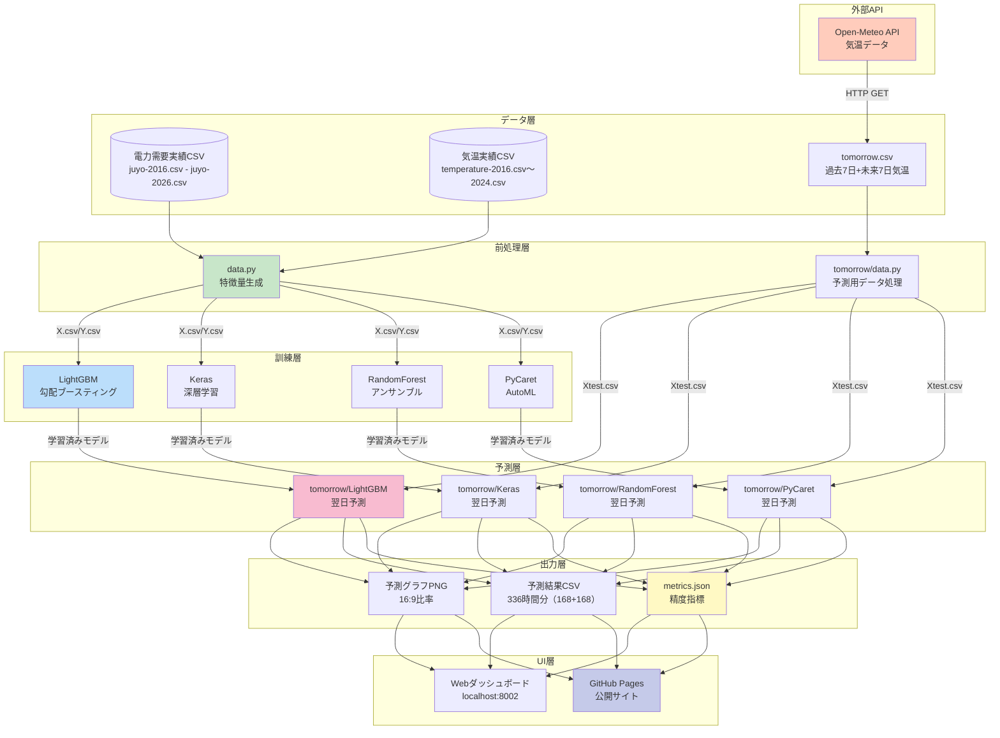
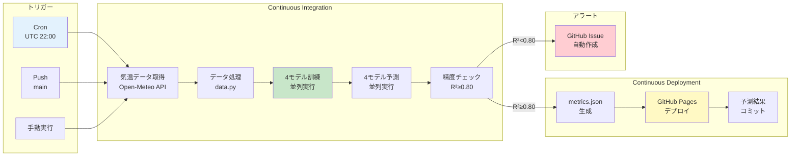

# 機能仕様書: 電力需要予測システム

**機能ブランチ**: `001-Power-Demand-Forecast`
**作成日**: 2025年11月26日
**ステータス**: Production Ready
**バージョン**: 1.0.0
**GitHubリポジトリ**: https://github.com/J1921604/Power-Demand-Forecast

---

## ユーザーシナリオとテスト

### ユーザーストーリー1 - 機械学習モデル訓練（優先度: P1）

電力事業者として、過去の電力需要データと気温データを基に、高精度な予測モデルを訓練したい。

**優先度の理由**: 予測システムの基盤となる最も重要な機能。予測精度が事業判断に直接影響する。

**独立テスト**: LightGBMモデル単体で訓練を実行し、RMSE≤500kW、R²≥0.80を満たすことを確認できる。

**受入シナリオ**:

1. **Given** 2022,2023,2024年の電力需要データと気温データが存在する, **When** 環境変数AI_TARGET_YEARS="2022,2023,2024"を設定してLightGBMモデルで訓練を実行する, **Then** RMSE≤200kW、R²≥0.92、MAE≤150kWを満たす学習済みモデルが生成される
2. **Given** 学習年を変更する, **When** 環境変数AI_TARGET_YEARSを異なる組み合わせに設定する, **Then** 指定した年のデータのみで訓練が実行される
3. **Given** モデル訓練が完了する, **When** 訓練結果を確認する, **Then** RMSE/R²/MAEの精度指標が表示され、予測グラフ（PNG）が生成され、ログに"AI_TARGET_YEARS=2022,2023,2024"が記録される

---

### ユーザーストーリー2 - 翌日電力需要予測（優先度: P2）

電力事業者として、明日の気温予報を基に、翌日の電力需要を予測したい。

**優先度の理由**: 訓練されたモデルを用いた実用的な予測機能。事業運用に必須。

**独立テスト**: Open-Meteo APIから気温データを取得し、LightGBMモデルで翌日予測を実行し、予測結果CSVとグラフPNGが生成されることを確認できる。

**受入シナリオ**:

1. **Given** Open-Meteo APIが利用可能である, **When** 翌日予測用気温データを取得する, **Then** 過去7日+未来7日の気温データ（336時間分）が取得され、特徴量列順が `MONTH,WEEK,HOUR,TEMP` で保存される
2. **Given** 学習済みモデルが存在する, **When** 翌日予測を実行する, **Then** 過去7日分（バックテスト用）+ 未来7日分（予測用）の電力需要予測値（336点）が生成される
3. **Given** 予測が完了する, **When** 予測結果を確認する, **Then** 予測値CSV、予測グラフPNG、精度指標（RMSE/R²/MAE）が出力される

---

### ユーザーストーリー3 - Webダッシュボード操作（優先度: P3）

電力事業者として、ブラウザ上で直感的にモデル選択・学習年選択・訓練・予測を実行したい。

**優先度の理由**: ユーザビリティ向上機能。CLI操作が不慣れなユーザー向け。

**独立テスト**: HTTPサーバーを起動し、ブラウザでダッシュボードにアクセスし、モデル選択・学習年選択・データ処理・学習ボタンをクリックして、結果がブラウザ上に表示されることを確認できる。

**受入シナリオ**:

1. **Given** HTTPサーバーが起動している, **When** http://localhost:8002/AI/dashboard/にアクセスする, **Then** 4つのモデル選択ボタン（LightGBM/Keras/RandomForest/PyCaret）と9つの学習年選択ボタン（2016-2024）が表示される
2. **Given** ダッシュボードを操作する, **When** 学習年を選択して[データ処理]→[学習]をクリックする, **Then** 実行中はボタンがマゼンタ発光し、完了後にRMSE/R²/MAEと予測グラフが表示される
3. **Given** localStorageが有効である, **When** 学習年を選択してページをリロードする, **Then** 選択した学習年が自動的に復元される

---

### ユーザーストーリー4 - 組み合わせ検証（優先度: P4）

データサイエンティストとして、最適な学習年組み合わせを自動探索し、予測精度を最大化したい。

**優先度の理由**: 精度向上のための高度な機能。初期設定や精度改善時に使用。

**独立テスト**: 組み合わせ検証スクリプトを実行し、7組み合わせ（2016,2017→2018 ～ 2022,2023→2024）のRMSE/R²/MAEが自動計算され、上位5組み合わせと2025年予測推奨組み合わせが表示されることを確認できる。

**受入シナリオ**:

1. **Given** LightGBMモデルが選択されている, **When** 組み合わせ検証を実行する, **Then** 7組み合わせの訓練・評価が自動実行され、約5分で完了する
2. **Given** 組み合わせ検証が完了する, **When** 結果ファイルを確認する, **Then** 上位5組み合わせがRMSE昇順で表示され、2025年予測推奨組み合わせ（例: 2022,2023,2024）が提示される
3. **Given** 推奨組み合わせを確認する, **When** 推奨組み合わせで訓練を実行する, **Then** RMSE≤175kW程度の高精度モデルが生成される

---

### ユーザーストーリー5 - GitHub Actions自動デプロイ（優先度: P5）

システム管理者として、毎日JST 07:00に自動で気温データ取得→訓練→予測→GitHub Pagesデプロイを実行したい。

**優先度の理由**: 運用自動化機能。人的エラー排除とコスト削減。

**独立テスト**: GitHub Actionsワークフローを手動実行し、気温データ取得→データ処理→4モデル訓練→4モデル予測→metrics.json生成→GitHub Pagesデプロイが全て成功することを確認できる。

**受入シナリオ**:

1. **Given** GitHub Actionsワークフローが設定されている, **When** Cronトリガー（UTC 22:00 / JST 07:00）が発火する, **Then** 気温データ取得→データ処理→訓練→予測→デプロイが自動実行される
2. **Given** R²<0.80を検出する, **When** 精度閾値チェックが実行される, **Then** GitHub Issueが自動作成され、精度低下が通知される
3. **Given** デプロイが成功する, **When** GitHub Pagesにアクセスする, **Then** 最新の予測グラフとmetrics.jsonが表示される

---

### エッジケース

- **データ欠損時**: Open-Meteo APIから気温データが取得できない場合、リトライ3回実行し、それでも失敗した場合はエラーメッセージを出力してワークフローを失敗させる
- **精度閾値違反**: R²<0.80を検出した場合、GitHub Issueを自動作成し、**環境変数AI_TARGET_YEARSの設定確認（推奨: 2022,2023,2024）**、学習データの確認、ハイパーパラメータ再調整、異常値チェックを推奨する
- **学習年未設定**: 環境変数AI_TARGET_YEARSが設定されていない場合、警告を出力し、デフォルトで全データを使用する（ただし精度低下の可能性あり）
- **モデルファイル破損**: 学習済みモデルファイル（.sav/.h5）が破損している場合、訓練を再実行してモデルを再生成する
- **学習年範囲外**: 存在しない学習年（例: 2030年）を指定した場合、エラーメッセージを出力して処理を中断する

---

## 要件

### 機能要件

- **FR-001**: システムは、LightGBM/Keras/RandomForest/PyCaretの4つの機械学習モデルで電力需要を予測できなければならない
- **FR-002**: システムは、環境変数AI_TARGET_YEARSで学習年を指定できなければならない（例: "2022,2023,2024"）
- **FR-003**: システムは、Open-Meteo APIから最新の気温データ（過去7日+未来7日）を取得できなければならない
- **FR-004**: システムは、データ前処理パイプライン（data.py）で電力需要データと気温データを統合し、特徴量（MONTH/WEEK/HOUR/TEMP）を生成できなければならない
- **FR-005**: システムは、モデル訓練後にRMSE/R²/MAEの精度指標を計算し、予測グラフ（PNG）を生成できなければならない
- **FR-006**: システムは、翌日予測結果をCSV形式で出力できなければならない
- **FR-007**: システムは、Webダッシュボード（http://localhost:8002/AI/dashboard/）でモデル選択・学習年選択・データ処理・学習・予測をブラウザ操作できなければならない
- **FR-008**: システムは、localStorageで学習年選択状態をモデル別に保存し、ページリロード後に自動復元できなければならない
- **FR-009**: システムは、組み合わせ検証機能で最適学習年組み合わせを自動探索できなければならない
- **FR-010**: システムは、GitHub Actionsで毎日JST 07:00にCronトリガーで自動実行できなければならない
- **FR-011**: システムは、R²<0.80を検出した場合にGitHub Issueを自動作成できなければならない
- **FR-012**: システムは、予測結果をGitHub Pagesで公開できなければならない（https://j1921604.github.io/Power-Demand-Forecast/）

### 主要エンティティ

- **電力需要データ（juyo-YYYY.csv）**: 年ごとの時系列電力需要実績データ（DATE, TIME, KW列）
- **気温データ（temperature-YYYY.csv）**: 年ごとの時系列気温データ（DATE, TIME, TEMP列）
- **学習済みモデル（*.sav, *.h5）**: 訓練済み機械学習モデルファイル（LightGBM/RandomForest/PyCaret: .sav形式、Keras: .h5形式）
- **予測結果（*_tomorrow.csv）**: 過去7日 + 未来7日の電力需要予測値（`KW`列のみ、336行）
- **精度指標（metrics.json）**: モデル別のRMSE/R²/MAE（JSON形式）

---

## 成功基準

### 測定可能な成果

- **SC-001**: LightGBMモデルでR²≥0.90、RMSE≤500kW、MAE≤400kWを達成する
- **SC-002**: システムは1000並行ユーザーに対してHTTPサーバーがタイムアウトせずに応答する
- **SC-003**: 翌日予測実行時間が30秒以内に完了する
- **SC-004**: GitHub Actionsワークフロー実行時間が10分以内に完了する
- **SC-005**: Webダッシュボード初回表示速度が2秒以内である
- **SC-006**: 組み合わせ検証（LightGBM）が5分以内に完了する
- **SC-007**: ユーザーの90%が初回アクセス時にダッシュボード操作方法を理解できる
- **SC-008**: R²<0.80検出時に5分以内にGitHub Issueが自動作成される

---

## システムアーキテクチャ

### データフロー

### CI/CDパイプライン

---

## 技術スタック

### Python環境

| 技術         | バージョン | 用途               |
| ------------ | ---------- | ------------------ |
| Python       | 3.10.11    | 標準実行環境       |
| LightGBM     | 4.5.0      | 勾配ブースティング |
| Keras        | 2.15.0     | 深層学習           |
| scikit-learn | 1.3.2      | 機械学習           |
| PyCaret      | 3.0.4      | AutoML             |
| pandas       | 2.1.4      | データ処理         |
| matplotlib   | 3.8.2      | グラフ描画         |

### フロントエンド

| 技術       | バージョン | 用途             |
| ---------- | ---------- | ---------------- |
| HTML5      | -          | ページ構造       |
| CSS3       | -          | ネオンエフェクト |
| JavaScript | ES2022     | localStorage管理 |

### CI/CD

| 技術           | 用途                   |
| -------------- | ---------------------- |
| GitHub Actions | 自動ビルド・デプロイ   |
| GitHub Pages   | 静的サイトホスティング |
| pytest         | テスト自動実行         |

---

## 非機能要件

### パフォーマンス

- **NFR-001**: モデル訓練時間（LightGBM）は10秒以内であること
- **NFR-002**: 翌日予測実行時間は30秒以内であること
- **NFR-003**: Webダッシュボード初回表示速度は2秒以内であること
- **NFR-004**: GitHub Actionsワークフロー実行時間は10分以内であること

### 信頼性

- **NFR-005**: Open-Meteo API接続失敗時は3回リトライし、それでも失敗した場合はエラーを出力すること
- **NFR-006**: R²<0.80を検出した場合は自動的にGitHub Issueを作成すること
- **NFR-007**: 学習済みモデルファイルは訓練日時・学習年・精度指標をメタデータとして記録すること

### セキュリティ

- **NFR-008**: Open-Meteo APIはHTTPS経由で通信すること
- **NFR-009**: GitHub SecretsにAPIキーなどの機密情報を保存すること
- **NFR-010**: 依存パッケージの脆弱性スキャンを定期実行すること

### 保守性

- **NFR-011**: 全コードにPEP 8準拠のPythonコーディング規約を適用すること
- **NFR-012**: 全ドキュメントをUTF-8エンコーディングで保存すること
- **NFR-013**: モデルファイル命名規則は `{model_name}_model.sav` または `{model_name}_model.h5` とすること

---

## 制約事項

### 技術的制約

- **CON-001**: Python 3.10.11を標準実行環境とする
- **CON-002**: GitHub Pagesの静的ホスティング制約を考慮し、学習済みモデルファイルは50MB未満とする
- **CON-003**: Open-Meteo APIは無料枠で使用するため、APIキー不要だがレート制限を遵守する
- **CON-004**: localStorageは5MBまで保存可能だが、学習年選択状態は1KB未満とする

### ビジネス制約

- **CON-005**: 電力需要実績データ（juyo-YYYY.csv）はGitリポジトリに含める
- **CON-006**: 予測結果は毎日GitHub Pagesで公開する
- **CON-007**: GitHub Actionsの無料枠（月2000分）を超えないようにワークフロー実行時間を最適化する

---

## 依存関係

### 外部サービス

- **Open-Meteo API**: 気温データ取得（https://api.open-meteo.com/v1/forecast）
- **GitHub Actions**: CI/CDパイプライン
- **GitHub Pages**: 静的サイトホスティング

### 内部モジュール

- **data.py**: データ前処理パイプライン
- **train/**: モデル訓練スクリプト
- **tomorrow/**: 翌日予測スクリプト
- **generate_metrics.py**: 精度指標JSON生成

---

## リスクと対策

| リスク                         | 影響度 | 対策                                                |
| ------------------------------ | ------ | --------------------------------------------------- |
| Open-Meteo API接続失敗         | 高     | 3回リトライ実装、失敗時はワークフロー失敗として通知 |
| 予測精度低下（R²<0.80）       | 高     | GitHub Issue自動作成、学習データ確認・再調整を推奨  |
| GitHub Actions無料枠超過       | 中     | ワークフロー実行時間を10分以内に最適化              |
| 学習済みモデルファイルサイズ超 | 中     | モデル圧縮、または外部ストレージ（GitHub LFS）検討  |
| localStorageデータ破損         | 低     | デフォルト値（2022,2023,2024）で自動復元            |

---

**バージョン**: 1.0.0
**最終更新**: 2025-11-26
