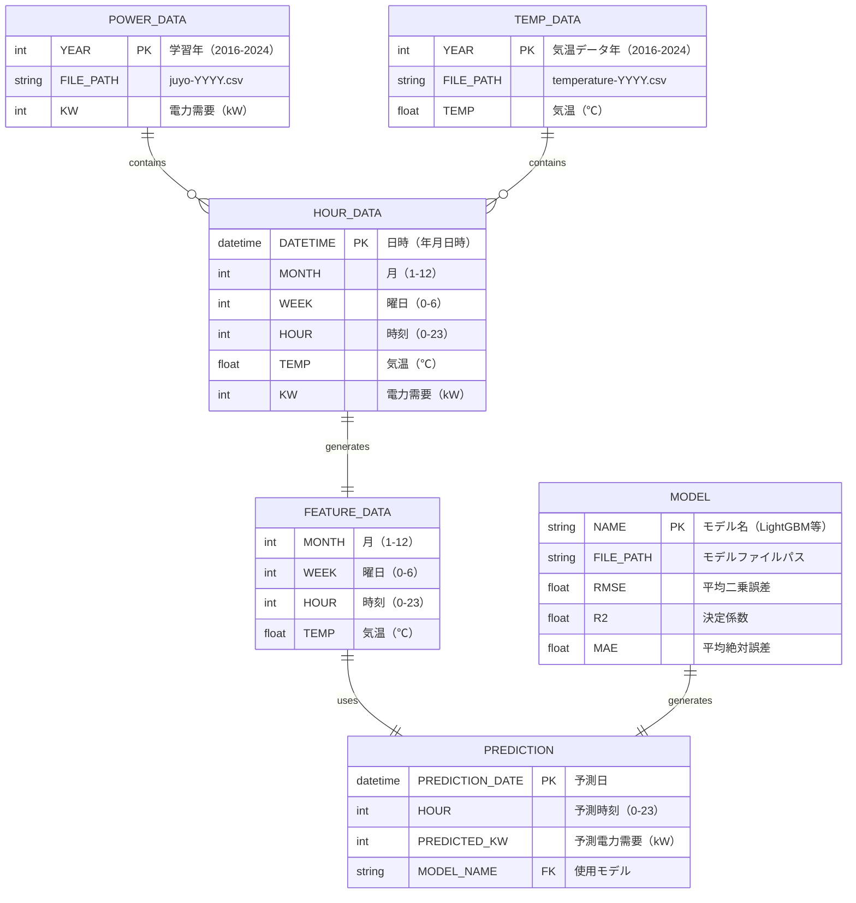
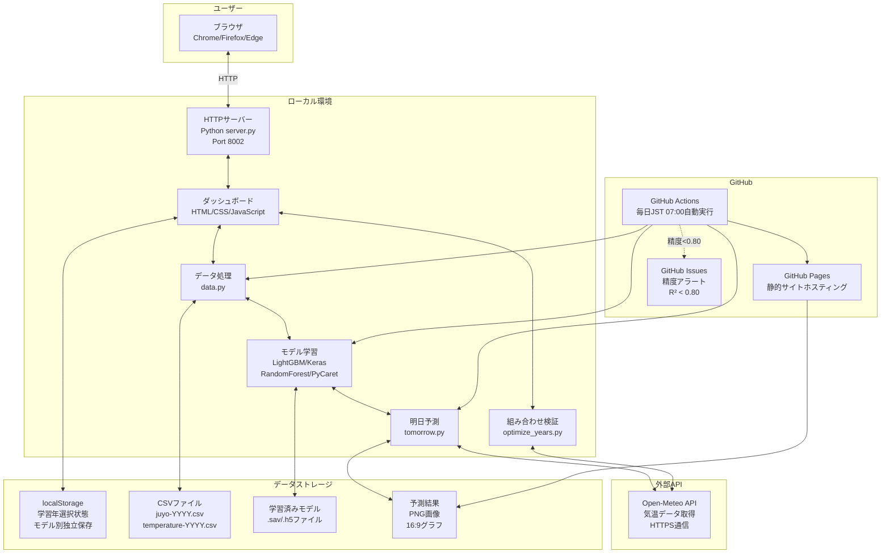
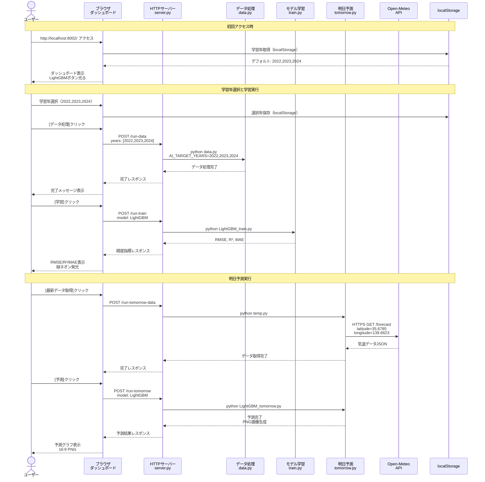
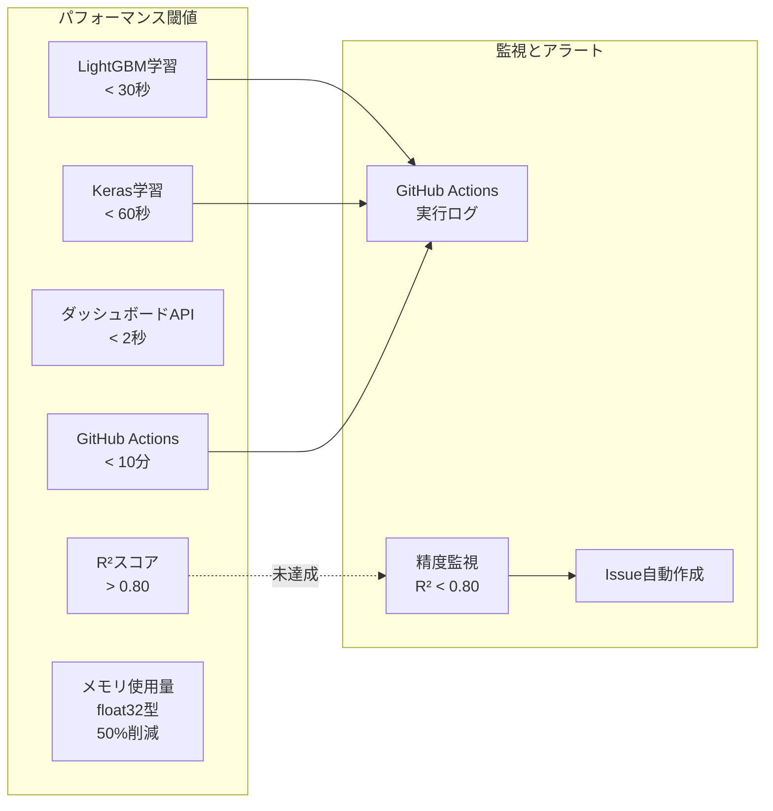
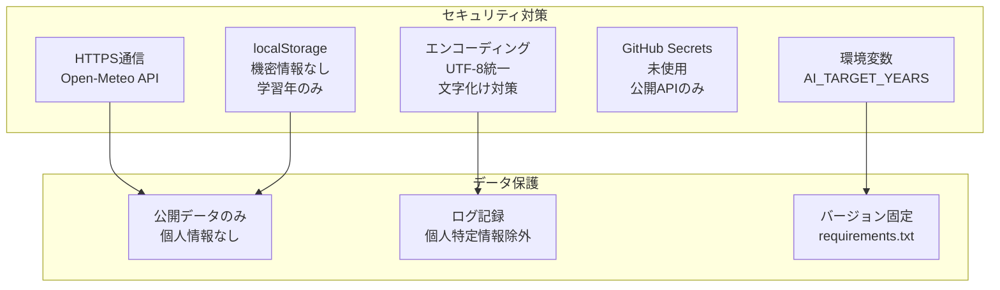
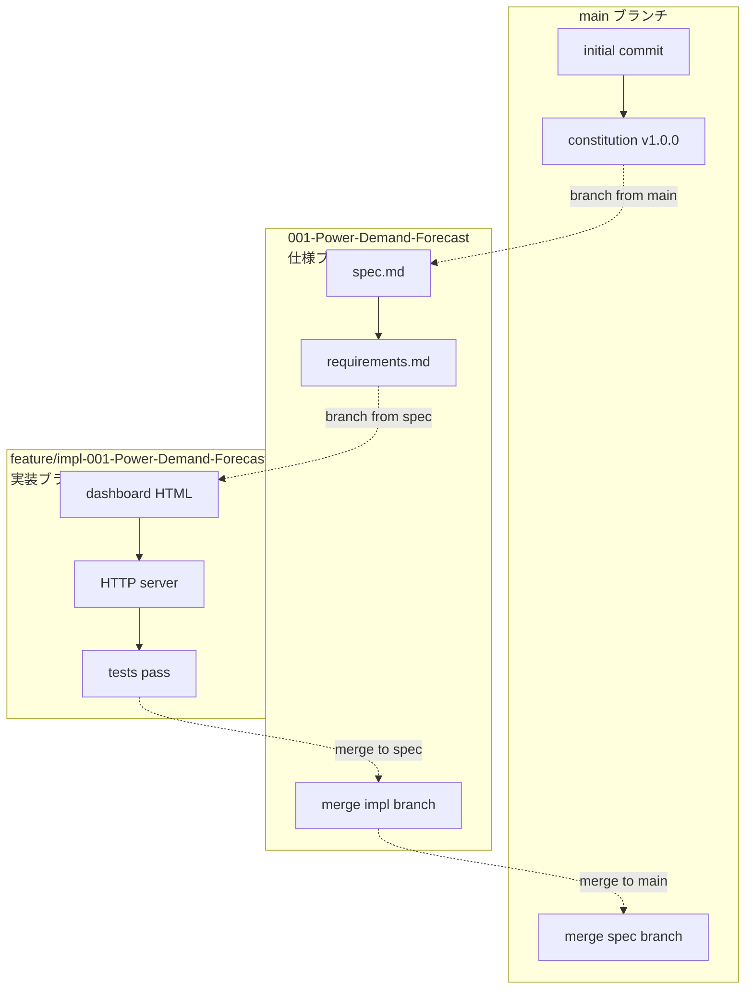

# 機能仕様書: 電力需要予測システム GitHub Pages版

**機能ブランチ**: `001-Power-Demand-Forecast`
**作成日**: 2025-11-26
**バージョン**: 1.0.0
**ステータス**: Completed
**入力**: 既存プロジェクト（Power-Demand-Forecast）のGitHub Pages化と統合ダッシュボード構築

---

## ユーザーシナリオとテスト *(必須)*

### ユーザーストーリー 1 - Webダッシュボードでモデル選択と学習実行 (優先度: P1) 🎯 MVP

ブラウザ操作のみで、4つの機械学習モデル（LightGBM、Keras、RandomForest、PyCaret）を選択し、学習年を指定してモデル学習を実行できる。

**この優先度の理由**: ダッシュボードはシステムの主要インターフェースであり、すべての機能の入り口となる。これがなければユーザーは何もできない。

**独立テスト**: ダッシュボードにアクセスし、LightGBMを選択、2022-2024年を選択、[学習]ボタンをクリックして、RMSE/R²/MAEが表示されることで検証できる。

**受入シナリオ**:

1. **Given** ユーザーがブラウザで`http://localhost:8002/`にアクセスしている, **When** ダッシュボードが表示される, **Then** 4つのモデル選択ボタン（LightGBM、Keras、RandomForest、PyCaret）が表示される
2. **Given** ユーザーがLightGBMボタンをクリックした, **When** 学習年選択UI（2016-2024年のボタン）が表示される, **Then** 複数年を選択でき、選択した年のボタンが光る（ネオングリーン発光エフェクト）
3. **Given** ユーザーが2022、2023、2024年を選択し[データ処理]ボタンをクリックした, **When** データ処理が完了する, **Then** 完了メッセージが表示される
4. **Given** データ処理が完了している, **When** [学習]ボタンをクリックする, **Then** 学習が開始され、完了後にRMSE、R²、MAEが表示される（緑ネオン発光アニメーション付き）
5. **Given** 学習が完了している, **When** ページをリロードする, **Then** localStorageに保存された学習年が自動復元され、選択状態が維持される（デフォルト: 2022, 2023, 2024）

---

### ユーザーストーリー 2 - 組み合わせ検証による最適学習年の自動探索 (優先度: P2)

ユーザーがモデルを選択し、[組み合わせ検証シミュレーション]ボタンをクリックすると、ローリング時系列交差検証により最適な学習年組み合わせが自動で探索され、上位5組み合わせと2025年予測推奨組み合わせが表示される。

**この優先度の理由**: 最適学習年の手動探索は時間がかかり非効率的。自動化により精度向上とユーザー体験改善を両立する。

**独立テスト**: ダッシュボードでLightGBMを選択し、[組み合わせ検証シミュレーション]ボタンをクリック、約5分後にメモ帳で結果ファイルが自動オープンされ、推奨組み合わせ（例: 2022,2023,2024）が表示されることで検証できる。

**受入シナリオ**:

1. **Given** ユーザーがダッシュボードでLightGBMを選択している, **When** [組み合わせ検証シミュレーション]ボタンをクリックする, **Then** マゼンタ系発光アニメーションが開始され、「実行中...」メッセージが表示される
2. **Given** 組み合わせ検証が実行中である, **When** 約5分の処理が完了する, **Then** テキストファイル（`YYYY-MM-DD_LightGBM_optimize_years.txt`）が自動生成され、メモ帳で自動オープンされる
3. **Given** 結果ファイルがオープンされている, **When** ユーザーが内容を確認する, **Then** 上位5組み合わせ（RMSE昇順）と2025年予測推奨組み合わせが明示されている
4. **Given** 推奨組み合わせ（例: 2022,2023,2024）を確認した, **When** ユーザーがダッシュボードで該当年をクリック選択する, **Then** 選択した学習年でモデル学習を実行できる

---

### ユーザーストーリー 3 - 明日の電力需要予測とグラフ表示 (優先度: P3)

ユーザーがモデル学習完了後、[最新データ取得]ボタンで気温データを取得し、[予測]ボタンをクリックすると、明日24時間の電力需要予測がグラフ（16:9）で表示される。

**この優先度の理由**: 学習したモデルの実用性を示す最終成果物。ただし、モデル学習（P1）と最適化（P2）が完了していないと実行できない。

**独立テスト**: 学習済みモデル（LightGBM）を使用し、[最新データ取得]→[予測]をクリック、明日の予測グラフ（PNG、16:9）が表示されることで検証できる。

**受入シナリオ**:

1. **Given** ユーザーがモデル学習を完了している, **When** [最新データ取得]ボタンをクリックする, **Then** Open-Meteo APIから過去7日+未来7日の気温データが取得される
2. **Given** 気温データが取得されている, **When** [予測]ボタンをクリックする, **Then** 明日24時間の電力需要予測が実行され、グラフ（PNG、16:9、ネオンブルー系配色）が表示される
3. **Given** 予測グラフが表示されている, **When** ユーザーがグラフを確認する, **Then** 時刻（0-23時）と予測電力需要（kW）が視覚化されている
4. **Given** 予測が完了している, **When** GitHub Pagesにデプロイする, **Then** 予測グラフが`https://j1921604.github.io/Power-Demand-Forecast/`で公開される

---

### エッジケース

- **ネットワークエラー時の処理**: Open-Meteo APIがタイムアウトした場合、リトライ機構（最大3回）が動作し、失敗時はエラーメッセージを表示する
- **不正な学習年選択**: ユーザーが学習年を1つも選択せずに[データ処理]ボタンをクリックした場合、警告メッセージを表示する
- **GitHub Actions実行時間超過**: モデル学習が10分を超える場合、GitHub Actionsがタイムアウトする。この場合、軽量モデル（LightGBM）を優先使用する
- **精度閾値未達**: R²スコアが0.80未満の場合、GitHub Actionsが自動でIssueを作成し、精度低下を通知する

---

## 要件 *(必須)*

### 機能要件

- **FR-001**: システムは、4つの機械学習モデル（LightGBM、Keras、RandomForest、PyCaret）を提供しなければならない
- **FR-002**: システムは、ユーザーが複数の学習年（2016-2024年）を選択できなければならない
- **FR-003**: システムは、選択した学習年でデータ処理（特徴量生成、データ統合）を実行しなければならない
- **FR-004**: システムは、処理済みデータを使用してモデル学習を実行し、RMSE、R²、MAEを計算しなければならない
- **FR-005**: システムは、ローリング時系列交差検証により最適学習年組み合わせを自動探索しなければならない
- **FR-006**: システムは、Open-Meteo APIからHTTPS通信で気温データを取得しなければならない
- **FR-007**: システムは、取得した気温データを使用して明日24時間の電力需要を予測しなければならない
- **FR-008**: システムは、予測結果をPNG画像（16:9）で保存し、ダッシュボードに表示しなければならない
- **FR-009**: システムは、localStorageを使用して学習年選択状態を永続化しなければならない（デフォルト: 2022, 2023, 2024）
- **FR-010**: システムは、GitHub Actionsで毎日JST 07:00（UTC 22:00）に自動実行されなければならない
- **FR-011**: システムは、GitHub Pagesに予測結果とダッシュボードをデプロイしなければならない
- **FR-012**: システムは、R²スコアが0.80未満の場合、GitHub Issueを自動作成しなければならない

---

### 主要エンティティ *(データを扱う機能に含める)*

```mermaid
erDiagram
    POWER_DATA ||--o{ HOUR_DATA : contains
    TEMP_DATA ||--o{ HOUR_DATA : contains
    HOUR_DATA ||--|| FEATURE_DATA : generates
    FEATURE_DATA ||--|| PREDICTION : uses
    MODEL ||--|| PREDICTION : generates

    POWER_DATA {
        int YEAR PK "学習年（2016-2024）"
        string FILE_PATH "juyo-YYYY.csv"
        int KW "電力需要（kW）"
    }

    TEMP_DATA {
        int YEAR PK "気温データ年（2016-2024）"
        string FILE_PATH "temperature-YYYY.csv"
        float TEMP "気温（℃）"
    }

    HOUR_DATA {
        datetime DATETIME PK "日時（年月日時）"
        int MONTH "月（1-12）"
        int WEEK "曜日（0-6）"
        int HOUR "時刻（0-23）"
        float TEMP "気温（℃）"
        int KW "電力需要（kW）"
    }

    FEATURE_DATA {
        int MONTH "月（1-12）"
        int WEEK "曜日（0-6）"
        int HOUR "時刻（0-23）"
        float TEMP "気温（℃）"
    }

    MODEL {
        string NAME PK "モデル名（LightGBM等）"
        string FILE_PATH "モデルファイルパス"
        float RMSE "平均二乗誤差"
        float R2 "決定係数"
        float MAE "平均絶対誤差"
    }

    PREDICTION {
        datetime PREDICTION_DATE PK "予測日"
        int HOUR "予測時刻（0-23）"
        int PREDICTED_KW "予測電力需要（kW）"
        string MODEL_NAME FK "使用モデル"
    }
```

**エンティティ説明**:

- **POWER_DATA**: 電力需要の履歴データ（2016-2024年のCSVファイル）
- **TEMP_DATA**: 気温の履歴データ（2016-2024年のCSVファイル）
- **HOUR_DATA**: 電力需要と気温を統合した時系列データ（1時間単位）
- **FEATURE_DATA**: 機械学習用の特徴量（MONTH、WEEK、HOUR、TEMP）
- **MODEL**: 学習済み機械学習モデル（LightGBM、Keras、RandomForest、PyCaret）
- **PREDICTION**: 明日24時間の電力需要予測結果

---

## 成功基準 *(必須)*

### 測定可能な成果

- **SC-001**: ユーザーがダッシュボードにアクセスしてからモデル学習完了までの操作を5分以内に完了できる
- **SC-002**: LightGBMモデルの学習時間が30秒以内である（GitHub Actions環境）
- **SC-003**: Kerasモデルの学習時間が60秒以内である（GitHub Actions環境）
- **SC-004**: R²スコアが0.80以上である（すべてのモデルで達成）
- **SC-005**: ダッシュボードのAPI応答時間が2秒以内である（ローカルHTTPサーバー）
- **SC-006**: GitHub Actionsワークフローが毎日JST 07:00に自動実行され、成功率95%以上である
- **SC-007**: 組み合わせ検証により、手動探索と比較して精度向上率10%以上を達成する
- **SC-008**: localStorage機能により、ページリロード後も学習年選択状態が100%復元される
- **SC-009**: Open-Meteo API通信の成功率が98%以上である（リトライ機構含む）
- **SC-010**: GitHub Pagesデプロイ後、予測グラフが5分以内に公開される

---

## システムアーキテクチャ

```mermaid
flowchart TB
    subgraph User["ユーザー"]
        A1[ブラウザ<br/>Chrome/Firefox/Edge]
    end

    subgraph Local["ローカル環境"]
        B1[HTTPサーバー<br/>Python server.py<br/>Port 8002]
        B2[ダッシュボード<br/>HTML/CSS/JavaScript]
        B3[データ処理<br/>data.py]
        B4[モデル学習<br/>LightGBM/Keras<br/>RandomForest/PyCaret]
        B5[明日予測<br/>tomorrow.py]
        B6[組み合わせ検証<br/>optimize_years.py]
    end

    subgraph API["外部API"]
        C1[Open-Meteo API<br/>気温データ取得<br/>HTTPS通信]
    end

    subgraph GitHub["GitHub"]
        D1[GitHub Actions<br/>毎日JST 07:00自動実行]
        D2[GitHub Pages<br/>静的サイトホスティング]
        D3[GitHub Issues<br/>精度アラート<br/>R² < 0.80]
    end

    subgraph Storage["データストレージ"]
        E1[localStorage<br/>学習年選択状態<br/>モデル別独立保存]
        E2[CSVファイル<br/>juyo-YYYY.csv<br/>temperature-YYYY.csv]
        E3[学習済みモデル<br/>.sav/.h5ファイル]
        E4[予測結果<br/>PNG画像<br/>16:9グラフ]
    end

    A1 <-->|HTTP| B1
    B1 <--> B2
    B2 <--> B3
    B3 <--> B4
    B4 <--> B5
    B2 <--> B6
    B5 <--> C1
    B6 <--> C1
    D1 --> B3
    D1 --> B4
    D1 --> B5
    D1 --> D2
    D1 -.->|精度<0.80| D3
    B2 <--> E1
    B3 <--> E2
    B4 <--> E3
    B5 <--> E4
    D2 --> E4
```

---

## データフロー

```mermaid
sequenceDiagram
    actor User as ユーザー
    participant Browser as ブラウザ<br/>ダッシュボード
    participant Server as HTTPサーバー<br/>server.py
    participant Data as データ処理<br/>data.py
    participant Model as モデル学習<br/>train.py
    participant Predict as 明日予測<br/>tomorrow.py
    participant API as Open-Meteo<br/>API
    participant Storage as localStorage

    Note over User,Storage: 初回アクセス時
    User->>Browser: http://localhost:8002/ アクセス
    Browser->>Storage: 学習年取得（localStorage）
    Storage-->>Browser: デフォルト: 2022,2023,2024
    Browser-->>User: ダッシュボード表示<br/>LightGBMボタン光る

    Note over User,Storage: 学習年選択と学習実行
    User->>Browser: 学習年選択（2022,2023,2024）
    Browser->>Storage: 選択年保存（localStorage）
    User->>Browser: [データ処理]クリック
    Browser->>Server: POST /run-data<br/>years: [2022,2023,2024]
    Server->>Data: python data.py<br/>AI_TARGET_YEARS=2022,2023,2024
    Data-->>Server: データ処理完了
    Server-->>Browser: 完了レスポンス
    Browser-->>User: 完了メッセージ表示

    User->>Browser: [学習]クリック
    Browser->>Server: POST /run-train<br/>model: LightGBM
    Server->>Model: python LightGBM_train.py
    Model-->>Server: RMSE, R², MAE
    Server-->>Browser: 精度指標レスポンス
    Browser-->>User: RMSE/R²/MAE表示<br/>緑ネオン発光

    Note over User,Storage: 明日予測実行
    User->>Browser: [最新データ取得]クリック
    Browser->>Server: POST /run-tomorrow-data
    Server->>Predict: python temp.py
    Predict->>API: HTTPS GET /forecast<br/>latitude=35.6785<br/>longitude=139.6823
    API-->>Predict: 気温データJSON
    Predict-->>Server: データ取得完了
    Server-->>Browser: 完了レスポンス

    User->>Browser: [予測]クリック
    Browser->>Server: POST /run-tomorrow<br/>model: LightGBM
    Server->>Predict: python LightGBM_tomorrow.py
    Predict-->>Server: 予測完了<br/>PNG画像生成
    Server-->>Browser: 予測結果レスポンス
    Browser-->>User: 予測グラフ表示<br/>16:9 PNG
```

---

## パフォーマンス要件

```mermaid
flowchart LR
    subgraph Performance["パフォーマンス閾値"]
        P1[LightGBM学習<br/>< 30秒]
        P2[Keras学習<br/>< 60秒]
        P3[ダッシュボードAPI<br/>< 2秒]
        P4[R²スコア<br/>> 0.80]
        P5[GitHub Actions<br/>< 10分]
        P6[メモリ使用量<br/>float32型<br/>50%削減]
    end

    subgraph Monitoring["監視とアラート"]
        M1[GitHub Actions<br/>実行ログ]
        M2[精度監視<br/>R² < 0.80]
        M3[Issue自動作成]
    end

    P4 -.->|未達成| M2
    M2 --> M3
    P1 --> M1
    P2 --> M1
    P5 --> M1
```

**定量的目標**:

- **学習時間**: LightGBM < 30秒、Keras < 60秒（GitHub Actions環境）
- **応答時間**: ダッシュボードAPI < 2秒（ローカル）
- **精度**: R² > 0.80（全モデル）
- **メモリ**: float32型使用で50%削減
- **可用性**: GitHub Actions成功率 > 95%

---

## セキュリティ要件

```mermaid
flowchart TB
    subgraph Security["セキュリティ対策"]
        S1[HTTPS通信<br/>Open-Meteo API]
        S2[環境変数<br/>AI_TARGET_YEARS]
        S3[localStorage<br/>機密情報なし<br/>学習年のみ]
        S4[GitHub Secrets<br/>未使用<br/>公開APIのみ]
        S5[エンコーディング<br/>UTF-8統一<br/>文字化け対策]
    end

    subgraph DataProtection["データ保護"]
        D1[公開データのみ<br/>個人情報なし]
        D2[ログ記録<br/>個人特定情報除外]
        D3[バージョン固定<br/>requirements.txt]
    end

    S1 --> D1
    S2 --> D3
    S3 --> D1
    S5 --> D2
```

**セキュリティ原則**:

- すべての外部API通信はHTTPS必須（Open-Meteo API）
- 機密データは存在しない（公開気温データと電力需要データのみ）
- localStorageには学習年選択状態のみ保存（個人情報なし）
- GitHub ActionsではSecrets不要（公開APIのみ使用）
- UTF-8エンコーディング統一で文字化け防止

---

## ブランチ戦略との整合性

```mermaid
flowchart TB
    subgraph main["main ブランチ"]
        M1[initial commit]
        M2[constitution v1.0.0]
        M3[merge spec branch]
    end

    subgraph spec["001-Power-Demand-Forecast<br/>仕様ブランチ"]
        S1[spec.md]
        S2[requirements.md]
        S3[merge impl branch]
    end

    subgraph impl["feature/impl-001-Power-Demand-Forecast<br/>実装ブランチ"]
        I1[dashboard HTML]
        I2[HTTP server]
        I3[tests pass]
    end

    M1 --> M2
    M2 -.->|branch from main| S1
    S1 --> S2
    S2 -.->|branch from spec| I1
    I1 --> I2
    I2 --> I3
    I3 -.->|merge to spec| S3
    S3 -.->|merge to main| M3
```

**ブランチ運用**:

1. **仕様ブランチ**: `001-Power-Demand-Forecast`（mainから派生）
   - 用途: spec.md、requirements.md作成
   - マージ条件: 仕様レビュー完了

2. **実装ブランチ**: `feature/impl-001-Power-Demand-Forecast`（仕様ブランチから派生）
   - 用途: コード実装、テスト実行
   - マージ条件: テスト通過、パフォーマンス閾値達成

---

## 前提条件と制約

### 前提条件

- Python 3.10.11がインストールされている
- VS Codeがインストールされている
- GitHubアカウントが作成されている
- ブラウザ（Chrome/Firefox/Edge）が利用可能である

### 制約

- GitHub Actions無料枠の実行時間制限（月2000分）を考慮する
- Open-Meteo APIは無料版の制限（1時間あたり10000リクエスト）内で使用する
- localStorageは5MBまでの制限があるが、学習年選択状態のみ保存するため問題ない
- GitHub Pagesは静的ファイルのみホスティング可能（動的バックエンド不可）

---

## 用語集

| 用語 | 定義 |
|------|------|
| **LightGBM** | 勾配ブースティング決定木の機械学習ライブラリ。高速・高精度が特徴。 |
| **Keras** | 深層学習フレームワーク。ニューラルネットワークの構築が容易。 |
| **RandomForest** | ランダムフォレスト。複数の決定木を組み合わせたアンサンブル学習。 |
| **PyCaret** | AutoML（自動機械学習）ライブラリ。モデル選択と最適化を自動化。 |
| **RMSE** | Root Mean Squared Error（平均二乗誤差の平方根）。予測誤差の指標。 |
| **R²** | 決定係数。モデルの説明力を示す指標（0-1、1に近いほど良い）。 |
| **MAE** | Mean Absolute Error（平均絶対誤差）。予測誤差の絶対値平均。 |
| **localStorage** | ブラウザのローカルストレージ。Webページをリロードしてもデータが永続化される。 |
| **組み合わせ検証** | ローリング時系列交差検証により最適学習年組み合わせを探索する機能。 |
| **GitHub Actions** | GitHubのCI/CDサービス。コード変更やスケジュールで自動実行。 |
| **GitHub Pages** | GitHubの静的サイトホスティングサービス。無料でWebサイト公開可能。 |
| **Open-Meteo API** | 無料の気象データAPI。過去・未来の気温データを取得可能。 |

---

**作成者**: GitHub Copilot
**レビュー状態**: Draft
**次のステップ**: requirements.md（品質チェックリスト）作成
