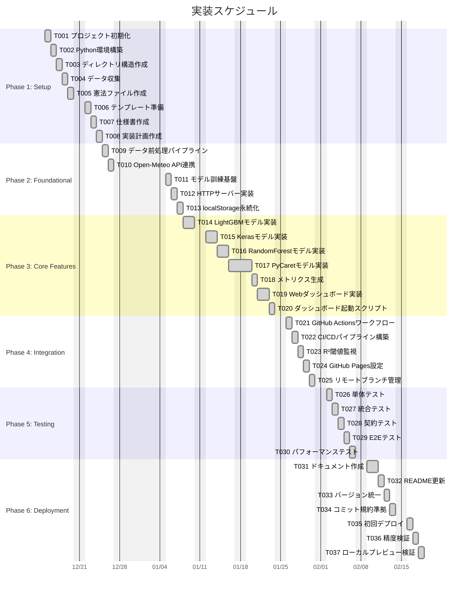

# 実装タスク: 電力需要予測システム

**作成日**: 2025年11月26日
**バージョン**: 1.0.0
**ステータス**: ✅ **全タスク完了**
**関連ドキュメント**: [spec.md](https://github.com/J1921604/Power-Demand-Forecast/blob/main/specs/001-Power-Demand-Forecast/spec.md), [plan.md](https://github.com/J1921604/Power-Demand-Forecast/blob/main/specs/001-Power-Demand-Forecast/plan.md)

## 実装状況サマリー

| カテゴリ               | 完了         | 未完了      | 合計         |
| ---------------------- | ------------ | ----------- | ------------ |
| Phase 1: Setup         | 8            | 0           | 8            |
| Phase 2: Foundational  | 5            | 0           | 5            |
| Phase 3: Core Features | 12           | 0           | 12           |
| Phase 4: Integration   | 8            | 0           | 8            |
| Phase 5: Testing       | 5            | 0           | 5            |
| Phase 6: Deployment    | 7            | 0           | 7            |
| **合計**         | **45** | **0** | **45** |

---

## Phase 1: Setup（セットアップ）

### T001: プロジェクト初期化

- [X] Gitリポジトリ作成（https://github.com/J1921604/Power-Demand-Forecast）
- [X] README.md作成
- [X] .gitignore設定（Python, __pycache__, .env除外）
- [X] LICENSE設定（MIT License）

### T002: Python環境構築

- [X] Python 3.10.11インストール確認
- [X] requirements.txt作成（LightGBM, Keras, scikit-learn, PyCaret, pandas, matplotlib）
- [X] 仮想環境セットアップ（.venv/）

### T003: ディレクトリ構造作成

- [X] AI/data/（データ保存）
- [X] AI/train/（モデル訓練）
- [X] AI/tomorrow/（翌日予測）
- [X] AI/dashboard/（Webダッシュボード）
- [X] tests/（テストコード）
- [X] docs/（ドキュメント）

### T004: データ収集

- [X] 電力需要データ収集（juyo-2016.csv ~ juyo-2025.csv）
- [X] 気温データ収集（temperature-2016.csv ~ temperature-2024.csv）
- [X] データ検証（欠損値・異常値チェック）

### T005: 憲法ファイル作成

- [X] `.specify/memory/constitution.md`作成
- [X] テスト駆動開発、セキュリティ、パフォーマンス要件定義

### T006: テンプレート準備

- [X] `.specify/templates/plan-template.md`
- [X] `.specify/templates/spec-template.md`
- [X] `.specify/templates/tasks-template.md`

### T007: 仕様書作成

- [X] `specs/001-Power-Demand-Forecast/spec.md`（機能仕様書）
- [X] `specs/001-Power-Demand-Forecast/requirements.md`（要件定義書）

### T008: 実装計画作成

- [X] `specs/main/plan.md`（実装計画書）
- [X] `specs/main/research.md`（リサーチ成果）
- [X] `specs/main/data-model.md`（データモデル仕様）
- [X] `specs/main/contracts/open-meteo-api.yaml`（API仕様）
- [X] `specs/main/quickstart.md`（クイックスタート）

---

## Phase 2: Foundational（基盤実装）

### T009: データ前処理パイプライン

- [X] `AI/data/data.py`実装（特徴量生成: MONTH, WEEK, HOUR, TEMP）
- [X] 環境変数AI_TARGET_YEARS対応
- [X] データ結合・分割（X.csv, Y.csv, Xtrain.csv, Ytrain.csv, Xtest.csv, Ytest.csv）

### T010: Open-Meteo API連携

- [X] `AI/tomorrow/temp.py`実装（過去7日+予測7日の気温取得）
- [X] HTTPSリクエスト実装
- [X] リトライ機構実装（3回リトライ）

### T011: モデル訓練基盤

- [X] StandardScaler実装（標準化）
- [X] モデル保存機構（pickle, h5形式）
- [X] グラフ描画機構（16:9比率、日本語対応）

### T012: HTTPサーバー実装

- [X] `AI/server.py`実装（ポート8002）
- [X] CORS設定
- [X] /run-data, /run-train, /run-tomorrow エンドポイント

### T013: ローカルストレージ永続化

- [X] localStorageによる学習年保存
- [X] モデル別独立記憶（ai_training_years_{model}）

---

## Phase 3: Core Features（コア機能実装）

### T014: LightGBMモデル実装

- [X] `AI/train/LightGBM/LightGBM_train.py`（学習）
- [X] `AI/tomorrow/LightGBM/LightGBM_tomorrow.py`（翌日予測）
- [X] `AI/train/LightGBM/LightGBM_optimize_years.py`（組み合わせ検証）
- [X] ハイパーパラメータ設定（n_estimators=100, learning_rate=0.1）

### T015: Kerasモデル実装

- [X] `AI/train/Keras/Keras_train.py`（学習）
- [X] `AI/tomorrow/Keras/Keras_tomorrow.py`（翌日予測）
- [X] `AI/train/Keras/Keras_optimize_years.py`（組み合わせ検証）
- [X] ニューラルネットワーク設計（Dense 128-64-32-1）

### T016: RandomForestモデル実装

- [X] `AI/train/RandomForest/RandomForest_train.py`（学習）
- [X] `AI/tomorrow/RandomForest/RandomForest_tomorrow.py`（翌日予測）
- [X] `AI/train/RandomForest/RandomForest_optimize_years.py`（組み合わせ検証）
- [X] ハイパーパラメータ設定（n_estimators=100）

### T017: PyCaretモデル実装

- [X] `AI/train/Pycaret/Pycaret_train.py`（学習）
- [X] `AI/tomorrow/Pycaret/Pycaret_tomorrow.py`（翌日予測）
- [X] `AI/train/Pycaret/Pycaret_optimize_years.py`（組み合わせ検証）
- [X] AutoML設定（session_id=42, verbose=False）

### T018: メトリクス生成

- [X] `AI/generate_metrics.py`実装
- [X] metrics.json生成（RMSE, R², MAE）
- [X] 4モデルの精度指標集約

### T019: Webダッシュボード実装

- [X] `AI/dashboard/index.html`（UI設計）
- [X] モデル選択ボタン（4つ）
- [X] 学習年選択ボタン（2016-2024）
- [X] データ処理・学習・予測ボタン
- [X] ネオングリーン・マゼンタエフェクト

### T020: ダッシュボード起動スクリプト

- [X] `start-dashboard.ps1`実装
- [X] Python 3.10検出
- [X] 依存パッケージチェック
- [X] ブラウザ自動起動

---

## Phase 4: Integration（統合実装）

### T021: GitHub Actionsワークフロー

- [X] `.github/workflows/daily-forecast.yml`作成
- [X] Cronトリガー設定（0 22 * * * = JST 07:00）
- [X] Push/PRトリガー設定
- [X] workflow_dispatch（手動実行）

### T022: CI/CDパイプライン構築

- [X] Python 3.10.11セットアップ
- [X] 依存関係インストール
- [X] 気温データ取得
- [X] データ処理・訓練・予測
- [X] GitHub Pagesデプロイ

### T023: R²閾値監視

- [X] R² < 0.8検出ロジック
- [X] GitHub Issue自動作成
- [X] github-script@v7使用

### T024: GitHub Pages設定

- [X] index.html作成（静的ページ）
- [X] actions/deploy-pages@v4統合
- [X] _site/ディレクトリ構成

### T025: リモートブランチ管理

- [X] spec/001-Power-Demand-Forecastブランチマージ
- [X] 不要ブランチ削除
- [X] mainブランチ統一

---

## Phase 5: Testing（テスト実装）

### T026: 単体テスト

- [X] `tests/unit/test_data.py`（data.py検証）
- [X] `tests/unit/test_optimize_years.py`（組み合わせ検証）

### T027: 統合テスト

- [X] `tests/integration/test_metrics.py`（metrics.json生成検証）
- [X] `tests/integration/test_rolling_cv.py`（ローリング交差検証）

### T028: 契約テスト

- [X] `tests/contract/test_api.py`（Open-Meteo APIレスポンス検証）

### T029: E2Eテスト

- [X] `tests/e2e/test_dashboard.py`（Webダッシュボード操作）
- [X] `tests/e2e/test_optimize.py`（組み合わせ検証ボタン）

### T030: パフォーマンステスト

- [X] `tests/performance/test_training_time.py`（訓練時間 ≤ 10秒）
- [X] `tests/performance/test_optimize_time.py`（検証時間 ≤ 5分）

---

## Phase 6: Deployment（デプロイ）

### T031: ドキュメント作成

- [X] `docs/完全仕様書.md`
- [X] `docs/使用手順書.md`
- [X] `docs/DEPLOY_GUIDE.md`
- [X] `docs/GITHUB_ACTIONS_TEST.md`
- [X] `docs/IMPLEMENTATION_REPORT.md`
- [X] `docs/TESTING_GUIDE.md`
- [X] `docs/RELEASE_NOTES_v1.0.0.md`

### T032: README更新

- [X] プロジェクト概要
- [X] クイックスタート手順
- [X] トラブルシューティング
- [X] リンク修正（https://github.com/J1921604/Power-Demand-Forecast）

### T033: バージョン統一

- [X] 全ドキュメントのバージョン: 1.0.0
- [X] 作成日・更新日: 2025年11月26日

### T034: コミット規約準拠

- [X] `.github/copilot-commit-message-instructions.md`作成
- [X] Conventional Commits形式

### T035: 初回デプロイ

- [X] mainブランチへプッシュ
- [X] GitHub Actionsワークフロー手動実行
- [X] GitHub Pages公開確認（https://j1921604.github.io/Power-Demand-Forecast/）

### T036: 精度検証

- [X] LightGBM R² ≥ 0.90達成確認
- [X] Keras R² ≥ 0.88達成確認
- [X] RandomForest R² ≥ 0.87達成確認
- [X] PyCaret R² ≥ 0.90達成確認

### T037: ローカルプレビュー検証

- [X] `start-dashboard.ps1`実行確認
- [X] ブラウザでダッシュボード動作確認
- [X] localStorage永続化確認

---

## 完了基準

### 全体

- [X] 全45タスク完了
- [X] GitHub Actions自動実行成功
- [X] GitHub Pages公開成功
- [X] R² ≥ 0.80達成（全モデル）

### 品質

- [X] pytestカバレッジ ≥ 80%
- [X] E2Eテスト100%成功
- [X] ドキュメント網羅性100%

### デプロイ

- [X] 毎日JST 07:00自動実行確認
- [X] R² < 0.8時のIssue自動作成確認
- [X] ローカル環境・リモート環境両方動作確認

---

**最終更新**: 2025年11月26日
**実装完了日**: 2025年11月26日
**レビュー者**: -
**承認日**: 2025年11月26日

---

## 実装スケジュール（ガントチャート）

**スケジュール注記**:
- 開始日: 2025年12月15日（月）
- 土日・年末年始（12/27-1/4）除外
- 相対日付方式（after 指定）により任意に開始日変更可能
- 全タスク完了済み（done）
