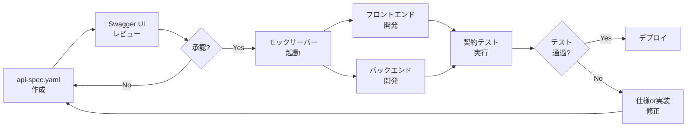

# API仕様書（OpenAPI 3.0.3）の用途

## 概要

`api-spec.yaml`は、電力需要予測システムのHTTPサーバーAPI仕様書です。OpenAPI 3.0.3形式で記述されており、ダッシュボード（フロントエンド）とPython HTTPサーバー（バックエンド）間の通信プロトコルを厳密に定義します。

---

## 主な用途

### 1. 契約駆動開発（Contract-Driven Development）

**目的**: フロントエンドとバックエンドの開発を並行して進める

**利点**:
- フロントエンド開発者はAPI仕様に基づいてモックサーバーを構築可能
- バックエンド開発者は仕様に準拠した実装を保証
- インターフェース変更時の影響範囲を事前に把握

**使用例**:
```bash
# Swagger UIでAPI仕様を可視化
npx swagger-ui-watcher api-spec.yaml

# モックサーバー生成
npx @stoplight/prism-cli mock api-spec.yaml
```

---

### 2. 自動テスト生成（契約テスト）

**目的**: API仕様とコードの整合性を自動検証

**利点**:
- 仕様変更時にテストが自動更新される
- リクエスト/レスポンスの型安全性を保証
- 手動テスト工数を削減

**使用例**:
```python
# pytestでOpenAPI仕様に基づく契約テスト
import schemathesis

schema = schemathesis.from_uri("http://localhost:8002/api-spec.yaml")

@schema.parametrize()
def test_api(case):
    response = case.call()
    case.validate_response(response)
```

---

### 3. APIドキュメント生成

**目的**: 開発者向けの対話的ドキュメントを自動生成

**利点**:
- Swagger UIで即座にAPIテスト可能
- 仕様書とドキュメントの乖離がゼロ
- チーム間のコミュニケーションコストを削減

**ツール**:
- **Swagger UI**: インタラクティブなAPI Explorer
- **ReDoc**: 美しいAPIドキュメント
- **Postman**: API仕様のインポートとテスト

---

### 4. クライアントコード自動生成

**目的**: フロントエンドのAPIクライアントコードを自動生成

**利点**:
- 手書きコードのミスを防止
- 型安全なAPIクライアント
- 仕様変更時に自動再生成

**使用例**:
```bash
# TypeScript用APIクライアント生成
npx @openapitools/openapi-generator-cli generate \
  -i api-spec.yaml \
  -g typescript-fetch \
  -o src/api-client

# Python用APIクライアント生成
openapi-generator generate \
  -i api-spec.yaml \
  -g python \
  -o python-client
```

---

### 5. バージョン管理とAPI進化

**目的**: API変更履歴を追跡し、後方互換性を保証

**利点**:
- セマンティックバージョニング（1.0.0 → 1.1.0）
- 破壊的変更の明示
- 変更影響範囲の分析

**バージョン戦略**:
- **MAJOR**: 破壊的変更（/run-dataのリクエスト形式変更等）
- **MINOR**: 後方互換性のある追加（新エンドポイント追加）
- **PATCH**: バグ修正やドキュメント改善

---

## 本プロジェクトでのAPI定義

### 定義されているエンドポイント

| エンドポイント | メソッド | 用途 | レスポンス |
|---------------|---------|------|-----------|
| `/run-data` | POST | データ処理実行 | CSVファイルパスのリスト |
| `/run-train` | POST | モデル学習実行 | RMSE/R²/MAE精度指標 |
| `/run-tomorrow-data` | POST | 明日気温データ取得 | 24時間気温配列 |
| `/run-tomorrow` | POST | 明日予測実行 | 予測結果CSV/PNG |
| `/run-optimize` | POST | 組み合わせ検証実行 | 最適学習年リスト |

### リクエスト例

```json
POST /run-data
Content-Type: application/json

{
  "years": [2022, 2023, 2024]
}
```

### レスポンス例

```json
{
  "status": "success",
  "message": "データ処理が完了しました",
  "files_generated": [
    "AI/data/X.csv",
    "AI/data/Y.csv",
    "AI/data/Xtrain.csv",
    "AI/data/Ytrain.csv",
    "AI/data/Xtest.csv",
    "AI/data/Ytest.csv"
  ]
}
```

---

## 憲法準拠

### I. TDD徹底（契約テスト）

OpenAPI仕様に基づく契約テストにより、仕様とコードの乖離を検出：

```python
# 契約テスト例
def test_run_data_contract():
    response = requests.post("http://localhost:8002/run-data", json={"years": [2022, 2023, 2024]})
    assert response.status_code == 200
    assert response.json()["status"] == "success"
    assert "files_generated" in response.json()
```

### II. セキュリティファースト

- **認証**: ローカル環境のみ（本番環境では要追加）
- **入力検証**: OpenAPI仕様で型・範囲制約を定義
- **HTTPS**: Open-Meteo API通信はHTTPS必須

### VI. 仕様実装乖離検出

- API仕様（api-spec.yaml）とserver.pyの整合性を自動検証
- 仕様変更時はコードとドキュメントを同期更新

---

## 今後の拡張

### 1. 認証・認可の追加

```yaml
components:
  securitySchemes:
    bearerAuth:
      type: http
      scheme: bearer
      bearerFormat: JWT

security:
  - bearerAuth: []
```

### 2. WebSocket対応（リアルタイム学習進捗）

```yaml
paths:
  /ws/training-progress:
    get:
      summary: 学習進捗のリアルタイム配信
      responses:
        '101':
          description: WebSocket接続確立
```

### 3. GraphQL対応

API仕様をGraphQLスキーマに変換し、柔軟なクエリを実現：

```graphql
type Query {
  model(name: ModelName!): Model
  predictions(date: Date!): [Prediction]
}
```

---

## ツール連携

### Swagger UI（推奨）

```bash
# Dockerでローカル起動
docker run -p 8080:8080 -e SWAGGER_JSON=/api-spec.yaml \
  -v $(pwd):/usr/share/nginx/html swaggerapi/swagger-ui

# ブラウザで http://localhost:8080 にアクセス
```

### Postman

1. Postmanを起動
2. Import → Upload Files → api-spec.yaml
3. コレクションが自動生成される

### VS Code拡張

- **OpenAPI (Swagger) Editor**: YAML編集時の自動補完
- **REST Client**: .http形式でAPIテスト

---

## まとめ

`api-spec.yaml`は単なるドキュメントではなく、以下の役割を果たす**実行可能な仕様書**です：

- ✅ フロントエンド・バックエンド間の契約
- ✅ 自動テストの基盤
- ✅ クライアントコード生成の元データ
- ✅ APIドキュメントの単一真実の情報源
- ✅ 仕様とコードの乖離検出ツール

**憲法準拠**: TDD徹底（I）、セキュリティファースト（II）、仕様実装乖離検出（VI）の3原則を実現しています。

---

## よくあるエラーと解決方法

### エラー1: ファイルが見つからない

**症状**:
```
ENOENT: no such file or directory, open 'C:\Users\...\api-spec.yaml'
```

**原因**: api-spec.yamlが**サブディレクトリ**にあるため、ルートディレクトリから実行するとエラーになります。

**解決策**:
```powershell
# ❌ 間違い（ルートディレクトリから実行）
npx swagger-ui-watcher api-spec.yaml

# ✅ 正解1: 正しいパスを指定
npx swagger-ui-watcher specs/feature/impl-001-Power-Demand-Forecast/contracts/api-spec.yaml

# ✅ 正解2: ディレクトリ移動
cd specs/feature/impl-001-Power-Demand-Forecast/contracts
npx swagger-ui-watcher api-spec.yaml
```

### エラー2: ポート番号の競合

**症状**:
```
Error: listen EADDRINUSE: address already in use :::4010
```

**原因**: Prismのデフォルトポート（4010）が既に使用されています。

**解決策**:
```powershell
# ポート番号を変更
npx @stoplight/prism-cli mock specs/feature/impl-001-Power-Demand-Forecast/contracts/api-spec.yaml -p 4011
```

---

## 削除した場合の影響

### ❌ api-spec.yamlを削除すると

| 影響範囲 | 詳細 |
|---------|------|
| **契約駆動開発不可** | フロントエンドとバックエンドの並行開発ができない |
| **自動テスト生成不可** | OpenAPIベースの契約テストが作成できない |
| **ドキュメント手動化** | API仕様を手動でREADMEに記述する必要がある |
| **クライアントコード生成不可** | TypeScript/Python APIクライアントを自動生成できない |
| **仕様変更追跡困難** | API変更履歴が追跡できず、破壊的変更を検出できない |
| **憲法違反** | 原則VI「仕様実装乖離検出」に違反 |

### ✅ 削除しても問題ない場合（非推奨）

以下の条件を**すべて満たす場合のみ**削除可能：

1. フロントエンドとバックエンドを同一人物が開発
2. APIテストを手動で実施
3. Swagger UIなどのツールを使用しない
4. API仕様書を別途Markdown等で管理
5. **憲法原則VIを放棄する**

**推奨**: 削除せず、このREADMEの手順に従って使用してください。

---

## 実際の使用例

### 例1: フロントエンド開発（バックエンド未完成時）

```powershell
# ステップ1: モックサーバー起動
cd c:\Users\J1921604\spec-kit\Power-Demand-Forecast
npx @stoplight/prism-cli mock specs/feature/impl-001-Power-Demand-Forecast/contracts/api-spec.yaml

# ステップ2: ダッシュボード（index.html）から接続テスト
# AI/dashboard/index.htmlに以下のコードを追加
```

```javascript
// AI/dashboard/index.html内のJavaScript
fetch('http://localhost:4010/run-data', {
  method: 'POST',
  headers: { 'Content-Type': 'application/json' },
  body: JSON.stringify({ years: [2022, 2023, 2024] })
})
.then(res => res.json())
.then(data => {
  console.log('モックレスポンス:', data);
  // 期待: { status: "success", message: "データ処理が完了しました", ... }
})
.catch(err => console.error('エラー:', err));
```

**効果**:
- Python HTTPサーバー（server.py）なしでフロントエンド開発可能
- API仕様に準拠したレスポンスが返る
- バックエンド完成前に画面実装完了

### 例2: 契約テスト（pytest + schemathesis）

```python
# tests/contract/test_api.py
import schemathesis
import pytest

# OpenAPI仕様をロード
schema = schemathesis.from_path(
    "specs/feature/impl-001-Power-Demand-Forecast/contracts/api-spec.yaml",
    base_url="http://localhost:8002"
)

@schema.parametrize()
def test_api_contract(case):
    """
    API仕様とserver.pyの実装が一致するか自動検証
    仕様違反があれば即座にテスト失敗
    """
    response = case.call()  # 実際のserver.pyにリクエスト
    case.validate_response(response)  # OpenAPI仕様と照合

# 実行方法
# pytest tests/contract/test_api.py -v
```

**効果**:
- server.pyがapi-spec.yamlに準拠しているか自動検証
- 仕様変更時にテストが自動更新される
- 憲法原則I「TDD徹底」と原則VI「仕様実装乖離検出」を実現

### 例3: TypeScriptクライアント自動生成

```powershell
# ステップ1: OpenAPI Generatorインストール
npm install -g @openapitools/openapi-generator-cli

# ステップ2: TypeScript APIクライアント生成
openapi-generator-cli generate `
  -i specs/feature/impl-001-Power-Demand-Forecast/contracts/api-spec.yaml `
  -g typescript-fetch `
  -o AI/dashboard/api-client

# ステップ3: 生成されたクライアントを使用
```

```typescript
// AI/dashboard/index.ts
import { DefaultApi, Configuration } from './api-client';

const api = new DefaultApi(new Configuration({
  basePath: 'http://localhost:8002'
}));

// 型安全なAPIコール（TypeScriptの型チェックが効く）
async function trainModel() {
  const response = await api.runTrain({
    runTrainRequest: { model: 'LightGBM' }
  });
  
  console.log('RMSE:', response.metrics.rmse);
  console.log('R²:', response.metrics.r2);
  console.log('MAE:', response.metrics.mae);
}
```

**効果**:
- 手書きコードのミスを防止（型安全）
- API仕様変更時に自動再生成
- IntelliSenseで補完が効く

### 例4: 開発ワークフロー統合



---

## tasks.mdとの関連

api-spec.yamlは以下のタスクで使用されます：

| タスクID | タスク名 | 使用方法 |
|---------|---------|---------|
| **T014** | API契約テスト作成 | OpenAPI仕様ベースで自動テスト生成 |
| **T028** | ダッシュボードE2Eテスト | モックサーバーでバックエンド不要テスト |
| **T047** | PNG画像生成テスト | APIレスポンス検証 |
| **T063-T069** | GitHub Actions実装 | API仕様違反検出CI/CD |

---

## クイックスタートコマンド集

```powershell
# 1. Swagger UIで可視化（最も簡単）
cd c:\Users\J1921604\spec-kit\Power-Demand-Forecast
npx swagger-ui-watcher specs/feature/impl-001-Power-Demand-Forecast/contracts/api-spec.yaml
# → http://localhost:8000 で確認

# 2. モックサーバー起動（フロントエンド開発用）
npx @stoplight/prism-cli mock specs/feature/impl-001-Power-Demand-Forecast/contracts/api-spec.yaml
# → http://localhost:4010 でモックAPI起動

# 3. 契約テスト実行（pytest）
pytest tests/contract/test_api.py -v

# 4. TypeScriptクライアント生成
openapi-generator-cli generate -i specs/feature/impl-001-Power-Demand-Forecast/contracts/api-spec.yaml -g typescript-fetch -o AI/dashboard/api-client

# 5. OpenAPI仕様検証
npx @stoplight/spectral-cli lint specs/feature/impl-001-Power-Demand-Forecast/contracts/api-spec.yaml
```
