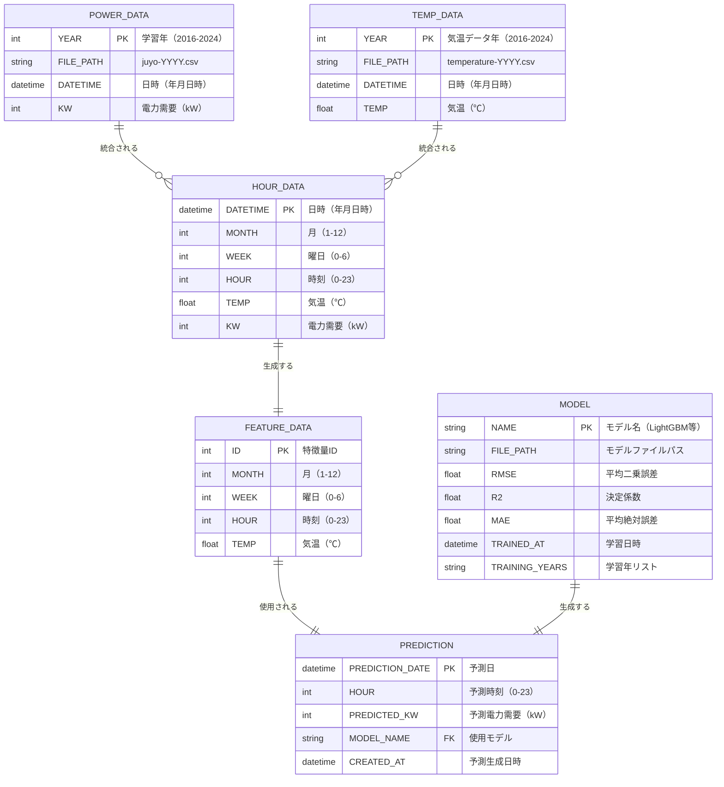
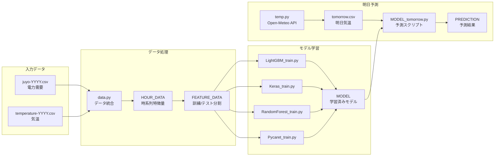
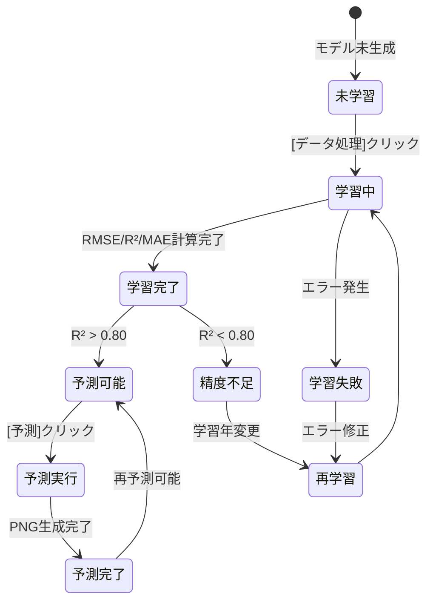

# Data Model: 電力需要予測システム

**Phase**: 1（設計）
**作成日**: 2025-11-26
**バージョン**: 1.0.0
**Plan**: [plan.md](plan.md)
**Research**: [research.md](research.md)

## 概要

電力需要予測システムのデータモデル定義。電力需要データ、気温データ、機械学習モデル、予測結果の4つの主要エンティティと、それらの関係性、バリデーションルール、状態遷移を定義します。

---

## エンティティ関係図



---

## エンティティ詳細

### 1. POWER_DATA（電力需要データ）

**責務**: 過去の電力需要履歴を保持し、学習データとして提供する

**フィールド定義**:

| フィールド名 | 型 | 制約 | 説明 |
|-------------|----|----|------|
| YEAR | int | PK, NOT NULL, 2016-2024 | 学習年（CSVファイル識別子） |
| FILE_PATH | string | NOT NULL, Pattern: `juyo-YYYY.csv` | CSVファイルパス |
| DATETIME | datetime | NOT NULL, Index | 日時（年月日時） |
| KW | int | NOT NULL, >= 0 | 電力需要（kW） |

**データソース**: `AI/data/juyo-YYYY.csv`（2016-2024年、各年約8760レコード）

**バリデーション**:
- YEAR: 2016 ≤ YEAR ≤ 2024
- KW: KW ≥ 0（負の電力需要は不正）
- DATETIME: 1時間単位（毎正時）

**サンプルデータ**:
```csv
DATETIME,KW
2024-01-01 00:00:00,12000
2024-01-01 01:00:00,11500
2024-01-01 02:00:00,11000
```

---

### 2. TEMP_DATA（気温データ）

**責務**: 過去の気温履歴を保持し、特徴量として提供する

**フィールド定義**:

| フィールド名 | 型 | 制約 | 説明 |
|-------------|----|----|------|
| YEAR | int | PK, NOT NULL, 2016-2024 | 気温データ年 |
| FILE_PATH | string | NOT NULL, Pattern: `temperature-YYYY.csv` | CSVファイルパス |
| DATETIME | datetime | NOT NULL, Index | 日時（年月日時） |
| TEMP | float | NOT NULL, -50 ≤ TEMP ≤ 50 | 気温（℃） |

**データソース**: `AI/data/temperature-YYYY.csv`（2016-2024年）

**バリデーション**:
- YEAR: 2016 ≤ YEAR ≤ 2024
- TEMP: -50 ≤ TEMP ≤ 50（東京の現実的な気温範囲）
- DATETIME: POWER_DATAと同じタイムスタンプ（1時間単位）

**サンプルデータ**:
```csv
DATETIME,TEMP
2024-01-01 00:00:00,5.2
2024-01-01 01:00:00,4.8
2024-01-01 02:00:00,4.5
```

---

### 3. HOUR_DATA（時系列データ統合）

**責務**: POWER_DATAとTEMP_DATAを統合し、時系列特徴量を生成

**フィールド定義**:

| フィールド名 | 型 | 制約 | 説明 |
|-------------|----|----|------|
| DATETIME | datetime | PK, NOT NULL | 日時（年月日時） |
| MONTH | int | NOT NULL, 1-12 | 月（1-12） |
| WEEK | int | NOT NULL, 0-6 | 曜日（0=月曜、6=日曜） |
| HOUR | int | NOT NULL, 0-23 | 時刻（0-23） |
| TEMP | float | NOT NULL | 気温（℃） |
| KW | int | NOT NULL | 電力需要（kW） |

**生成ロジック**:
```python
# AI/data/data.py
def merge_power_and_temp(power_data, temp_data):
    hour_data = pd.merge(power_data, temp_data, on='DATETIME', how='inner')
    hour_data['MONTH'] = hour_data['DATETIME'].dt.month
    hour_data['WEEK'] = hour_data['DATETIME'].dt.dayofweek
    hour_data['HOUR'] = hour_data['DATETIME'].dt.hour
    return hour_data
```

**出力ファイル**: `AI/data/X.csv`（特徴量）、`AI/data/Y.csv`（ラベル）

**バリデーション**:
- DATETIME: POWER_DATAとTEMP_DATAの内部結合（欠損値なし）
- MONTH: 1 ≤ MONTH ≤ 12
- WEEK: 0 ≤ WEEK ≤ 6
- HOUR: 0 ≤ HOUR ≤ 23

---

### 4. FEATURE_DATA（機械学習特徴量）

**責務**: 機械学習モデルの入力特徴量を提供

**フィールド定義**:

| フィールド名 | 型 | 制約 | 説明 |
|-------------|----|----|------|
| ID | int | PK, Auto Increment | 特徴量ID |
| MONTH | int | NOT NULL, 1-12 | 月（1-12） |
| WEEK | int | NOT NULL, 0-6 | 曜日（0-6） |
| HOUR | int | NOT NULL, 0-23 | 時刻（0-23） |
| TEMP | float | NOT NULL | 気温（℃） |

**データ型最適化**:
```python
# メモリ削減（憲法III準拠）
feature_data = feature_data.astype('float32')  # メモリ約50%削減
```

**出力ファイル**: `AI/data/Xtrain.csv`（訓練用）、`AI/data/Xtest.csv`（テスト用）

**バリデーション**:
- MONTH: 1 ≤ MONTH ≤ 12
- WEEK: 0 ≤ WEEK ≤ 6
- HOUR: 0 ≤ HOUR ≤ 23
- TEMP: 欠損値なし（nullチェック）

---

### 5. MODEL（機械学習モデル）

**責務**: 学習済みモデルと精度指標を管理

**フィールド定義**:

| フィールド名 | 型 | 制約 | 説明 |
|-------------|----|----|------|
| NAME | string | PK, NOT NULL, Enum: [LightGBM, Keras, RandomForest, Pycaret] | モデル名 |
| FILE_PATH | string | NOT NULL | モデルファイルパス（.sav/.h5） |
| RMSE | float | NOT NULL, >= 0 | 平均二乗誤差 |
| R2 | float | NOT NULL, -∞ to 1.0 | 決定係数 |
| MAE | float | NOT NULL, >= 0 | 平均絶対誤差 |
| TRAINED_AT | datetime | NOT NULL | 学習日時 |
| TRAINING_YEARS | string | NOT NULL, Pattern: `\d{4}(,\d{4})*` | 学習年リスト（例: "2022,2023,2024"） |

**ストレージ**:
- **LightGBM/RandomForest/PyCaret**: `AI/train/{MODEL}/LightGBM_model.sav`（pickle形式）
- **Keras**: `AI/train/Keras/Keras_model.h5`（HDF5形式）

**精度閾値**（憲法III準拠）:
- R2: > 0.80（閾値未達でGitHub Issue自動作成）
- RMSE: モデルごとに異なる閾値（LightGBM < 500）

**バリデーション**:
- R2: R2 > 0.80（成功基準）
- RMSE: RMSE >= 0（非負）
- TRAINING_YEARS: カンマ区切り年リスト（例: "2022,2023,2024"）

**サンプルデータ**:
```json
{
  "NAME": "LightGBM",
  "FILE_PATH": "AI/train/LightGBM/LightGBM_model.sav",
  "RMSE": 456.78,
  "R2": 0.87,
  "MAE": 345.12,
  "TRAINED_AT": "2025-11-26T07:00:00",
  "TRAINING_YEARS": "2022,2023,2024"
}
```

---

### 6. PREDICTION（電力需要予測結果）

**責務**: 明日24時間の電力需要予測を保持

**フィールド定義**:

| フィールド名 | 型 | 制約 | 説明 |
|-------------|----|----|------|
| PREDICTION_DATE | datetime | PK, NOT NULL | 予測日（明日の日付） |
| HOUR | int | PK, NOT NULL, 0-23 | 予測時刻（0-23） |
| PREDICTED_KW | int | NOT NULL, >= 0 | 予測電力需要（kW） |
| MODEL_NAME | string | FK → MODEL.NAME, NOT NULL | 使用モデル |
| CREATED_AT | datetime | NOT NULL | 予測生成日時 |

**出力ファイル**: `AI/tomorrow/{MODEL}/{MODEL}_tomorrow.csv`、`AI/tomorrow/{MODEL}/{MODEL}_tomorrow.png`（グラフ）

**バリデーション**:
- PREDICTION_DATE: 明日の日付（今日 + 1日）
- HOUR: 0 ≤ HOUR ≤ 23（24時間分）
- PREDICTED_KW: PREDICTED_KW >= 0（非負）
- MODEL_NAME: MODELエンティティに存在

**サンプルデータ**:
```csv
PREDICTION_DATE,HOUR,PREDICTED_KW,MODEL_NAME,CREATED_AT
2025-11-26,0,12500,LightGBM,2025-11-25T10:00:00
2025-11-26,1,12000,LightGBM,2025-11-25T10:00:00
2025-11-26,2,11500,LightGBM,2025-11-25T10:00:00
```

---

## データフロー



---

## 状態遷移

### MODELエンティティ状態遷移



**状態定義**:
- **未学習**: モデルファイル（.sav/.h5）が存在しない
- **学習中**: `{MODEL}_train.py`実行中
- **学習完了**: RMSE/R²/MAE計算完了、モデルファイル保存済み
- **学習失敗**: 例外発生（データ不足、メモリ不足等）
- **予測可能**: R² > 0.80、モデルが予測に使用可能
- **精度不足**: R² < 0.80、GitHub Issue自動作成
- **再学習**: 学習年変更またはハイパーパラメータ調整
- **予測実行**: `{MODEL}_tomorrow.py`実行中
- **予測完了**: CSV/PNG生成完了、GitHub Pagesにコミット

---

## バリデーションルール

### 1. データ整合性

| ルール | 検証内容 | エラー処理 |
|--------|---------|-----------|
| **時刻整合性** | POWER_DATAとTEMP_DATAのDATETIMEが一致 | 欠損値を前後補間、ログ出力 |
| **年範囲** | 学習年が2016-2024の範囲内 | ValueError例外、UI上で警告表示 |
| **非負制約** | KW、PREDICTED_KW、RMSE、MAEが非負 | ValueError例外、データ修正 |
| **精度閾値** | R² > 0.80 | GitHub Issue自動作成、ユーザー通知 |

### 2. 型変換と精度

```python
# float32型変換（憲法III: パフォーマンス定量化）
X_train = X_train.astype('float32')
y_train = y_train.astype('float32')

# 精度検証
if r2_score < 0.80:
    raise ValueError(f"R² score {r2_score} is below threshold 0.80")
```

### 3. ファイル存在確認

```python
# モデルファイル存在確認
model_path = f"AI/train/{model_name}/{model_name}_model.sav"
if not os.path.exists(model_path):
    raise FileNotFoundError(f"Model file not found: {model_path}")
```

---

## パフォーマンス最適化

### 1. メモリ使用量削減

**戦略**: float64 → float32変換で約50%削減

```python
# 変換前（float64）: 約2GB
# 変換後（float32）: 約1GB
df = df.astype({
    'TEMP': 'float32',
    'KW': 'int32',
    'PREDICTED_KW': 'int32'
})
```

### 2. CSVファイルサイズ

| ファイル | レコード数 | サイズ（圧縮前） | サイズ（圧縮後） |
|---------|-----------|----------------|----------------|
| juyo-2024.csv | 8760 | 約200KB | 約50KB |
| temperature-2024.csv | 8760 | 約200KB | 約50KB |
| X.csv（10年分） | 87,600 | 約2MB | 約500KB |
| Y.csv（10年分） | 87,600 | 約1MB | 約250KB |

### 3. インデックス設計

**HOUR_DATA**:
- PRIMARY KEY: DATETIME（B-Treeインデックス）
- INDEX: (YEAR, MONTH)（集約クエリ最適化）

---

## セキュリティ考慮事項（憲法II準拠）

### 1. 機密データ

**該当なし** - すべて公開データ（電力需要、気温）、個人情報なし

### 2. localStorage

**保存内容**: 学習年選択状態のみ（例: `[2022,2023,2024]`）
**セキュリティリスク**: なし（個人情報なし、XSS対策済み）

### 3. Open-Meteo API

**通信方式**: HTTPS必須
**認証**: 不要（無料版、APIキーなし）
**レート制限**: 1時間10000リクエスト（本プロジェクトは1日1回）

---

## 次のステップ

Phase 1の残りのドキュメントを生成します：

1. **contracts/**: API仕様（OpenAPI形式）
2. **quickstart.md**: ワンコマンド起動手順

---

**作成者**: GitHub Copilot
**レビュー状態**: Completed
**最終更新日**: 2025-11-26
