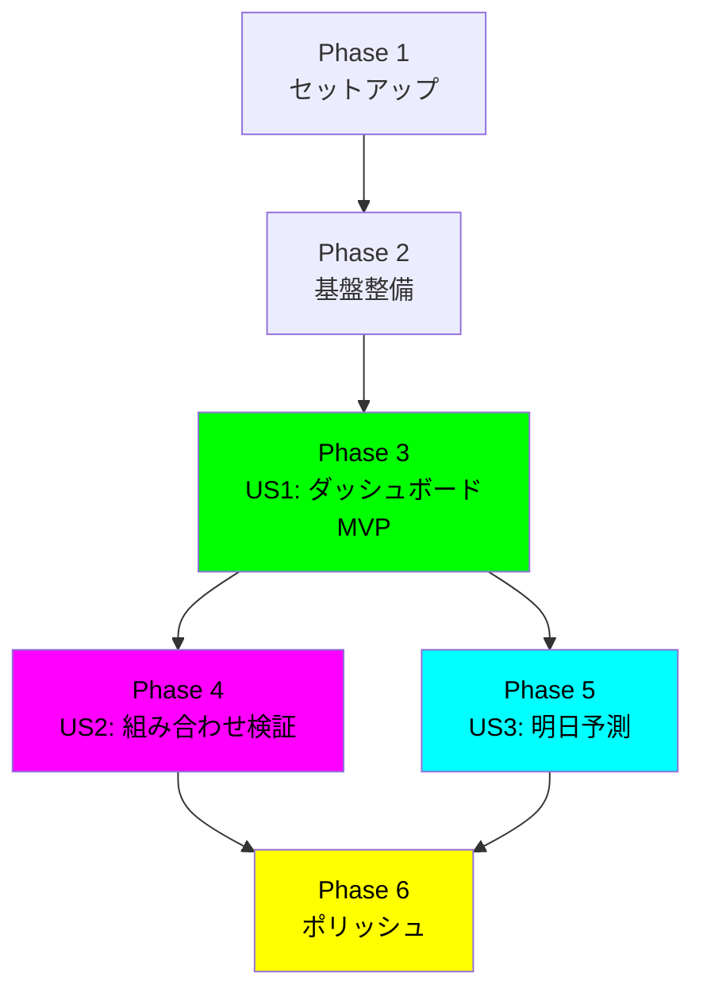
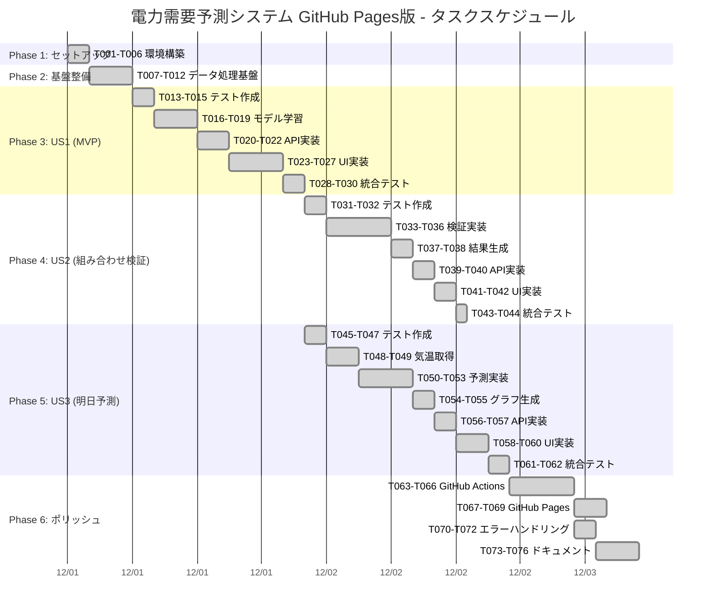
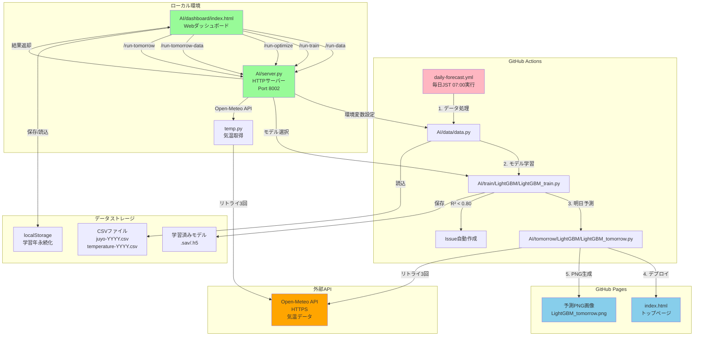
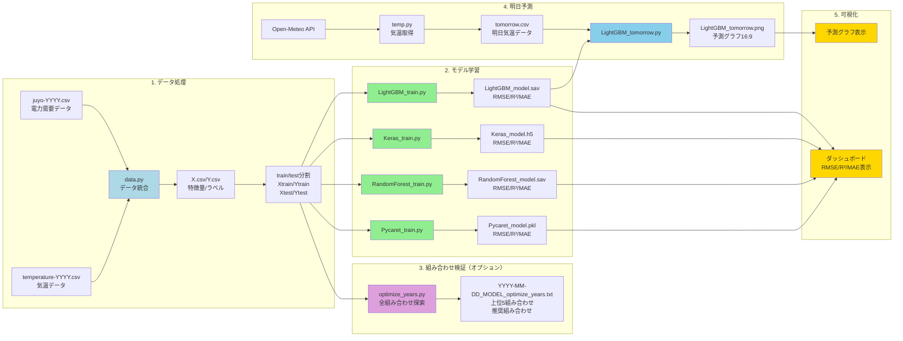

# タスク分解: 電力需要予測システム GitHub Pages版

**ブランチ**: `feature/impl-001-Power-Demand-Forecast`
**作成日**: 2025-11-26
**Phase**: 2（タスク分解）
**計画書**: [plan.md](plan.md)
**仕様書**: [spec.md](https://github.com/J1921604/Power-Demand-Forecast/blob/main/specs/001-Power-Demand-Forecast/spec.md)

---

## タスク実行ガイドライン

### チェックリスト形式

すべてのタスクは以下の形式で記述されます：

```
- [ ] [T001] [P] [US1] タスク説明 (ファイルパス)
```

**凡例**:

- `[ ]`: 未完了のチェックボックス
- `[T001]`: タスクID（通し番号）
- `[P]`: 並列実行可能マーカー（異なるファイル、依存関係なし）
- `[US1]`: ユーザーストーリー番号（US1=P1、US2=P2、US3=P3）
- **ファイルパス**: 実装対象ファイルの絶対パスまたは相対パス

### 実行原則

1. **TDD徹底**: テストタスクを先に実行（Red-Green-Refactorサイクル）
2. **並列実行**: `[P]`マーカーがあるタスクは同時実行可能
3. **依存関係**: 各フェーズの先頭に依存関係を明記
4. **独立テスト**: 各ユーザーストーリーは独立してテスト可能

---

## Phase 1: セットアップ（プロジェクト初期化）

**目的**: 開発環境とインフラの構築

**依存関係**: なし（最初のフェーズ）

### タスク一覧

- [X] [T001] Python 3.10.11環境確認スクリプト作成 (.github/scripts/check-python.ps1)
- [X] [T002] requirements.txtバージョン固定確認とPython 3.10.11動作検証 (AI/requirements.txt)
- [X] [T003] [P] .gitignore更新（学習済みモデル、CSVファイル、__pycache__除外） (.gitignore)
- [X] [T004] [P] READMEにワンコマンド起動手順追記（start-dashboard.ps1） (README.md)
- [X] [T005] [P] DEPLOY_GUIDEにGitHub Actions手順追記 (docs/DEPLOY_GUIDE.md)
- [X] [T006] VS Code拡張推奨リスト作成（Python、Mermaid、OpenAPI） (.vscode/extensions.json)

**完了基準**:

- Python 3.10.11が正常に検出される
- start-dashboard.ps1が正常動作する
- READMEが最新の起動手順を反映

---

## Phase 2: 基盤整備（全ユーザーストーリーの前提条件）

**目的**: データ処理とHTTPサーバーの基盤機能を実装

**依存関係**: Phase 1完了後

### タスク一覧

- [X] [T007] データ統合スクリプトのリファクタリング（環境変数AI_TARGET_YEARS対応） (AI/data/data.py)
- [X] [T008] [P] HTTPサーバーのCORS設定とエラーハンドリング強化 (AI/server.py)
- [X] [T009] [P] CSVファイル存在確認とバリデーション関数実装 (AI/data/data.py)
- [X] [T010] float32型変換によるメモリ最適化実装 (AI/data/data.py)
- [X] [T011] [P] pytest環境セットアップとテストディレクトリ作成 (tests/)
- [X] [T012] データ処理の単体テスト作成（data.py） (tests/unit/test_data.py)

**完了基準**:

- AI_TARGET_YEARS環境変数で学習年を制御できる
- HTTPサーバーがエラー時に適切なJSONレスポンスを返す
- データ処理テストが通過する

---

## Phase 3: ユーザーストーリー 1（ダッシュボード操作とモデル学習） - MVP 🎯

**目的**: Webダッシュボードでモデル選択・学習年選択・学習実行を実現

**依存関係**: Phase 2完了後

**独立テスト**: ダッシュボードにアクセスし、LightGBMを選択、2022-2024年を選択、[学習]ボタンをクリックして、RMSE/R²/MAEが表示されることで検証

### タスク一覧

#### 3.1 テスト先行作成(TDD)

- [X] [T013] [P] [US1] ダッシュボードE2Eテスト作成（Playwright/Selenium） (tests/e2e/test_dashboard.py)
- [X] [T014] [P] [US1] API契約テスト作成（/run-data、/run-train） (tests/contract/test_api.py)
- [X] [T015] [P] [US1] localStorage永続化テスト作成 (tests/integration/test_localstorage.js)

#### 3.2 モデル学習実装

- [X] [T016] [US1] LightGBM学習スクリプトの精度閾値テスト追加 (AI/train/LightGBM/LightGBM_train.py)
- [X] [T017] [P] [US1] Keras学習スクリプトの精度閾値テスト追加 (AI/train/Keras/Keras_train.py)
- [X] [T018] [P] [US1] RandomForest学習スクリプトの精度閾値テスト追加 (AI/train/RandomForest/RandomForest_train.py)
- [X] [T019] [P] [US1] PyCaret学習スクリプトの精度閾値テスト追加 (AI/train/Pycaret/Pycaret_train.py)

#### 3.3 HTTPサーバーAPI実装

- [X] [T020] [US1] /run-dataエンドポイント実装（環境変数AI_TARGET_YEARS設定） (AI/server.py)
- [X] [T021] [US1] /run-trainエンドポイント実装（モデル名動的実行） (AI/server.py)
- [X] [T022] [US1] エラーハンドリングとログ記録実装 (AI/server.py)

#### 3.4 ダッシュボードUI実装

- [X] [T023] [US1] モデル選択ボタンUI実装（4つのボタン、ネオングリーン発光） (AI/dashboard/index.html)
- [X] [T024] [US1] 学習年選択UI実装（2016-2024年ボタン、複数選択可能） (AI/dashboard/index.html)
- [X] [T025] [US1] localStorage学習年永続化実装（デフォルト: 2022,2023,2024） (AI/dashboard/index.html)
- [X] [T026] [US1] [データ処理]ボタンと完了メッセージ表示 (AI/dashboard/index.html)
- [X] [T027] [US1] [学習]ボタンとRMSE/R²/MAE表示（緑ネオン発光） (AI/dashboard/index.html)

#### 3.5 統合テストと検証

- [X] [T028] [US1] ダッシュボードE2Eテスト実行（全受入シナリオ検証） (tests/e2e/test_dashboard.py)
- [X] [T029] [US1] パフォーマンステスト（LightGBM < 30秒、API < 2秒） (tests/performance/test_training_time.py)
- [X] [T030] [US1] R²スコア閾値テスト（> 0.80確認） (tests/integration/test_metrics.py)

**完了基準**:

- ダッシュボードで4モデルすべてが学習可能
- localStorage学習年が永続化される
- RMSE/R²/MAEが正しく表示される
- すべてのテストが通過

---

## Phase 4: ユーザーストーリー 2（組み合わせ検証）

**目的**: 最適学習年の自動探索機能を実装

**依存関係**: Phase 3（US1）完了後

**独立テスト**: LightGBMで[組み合わせ検証シミュレーション]をクリック、約5分後にメモ帳で結果ファイルが開き、推奨組み合わせが表示されることで検証

### タスク一覧

#### 4.1 テスト先行作成（TDD）

- [X] [T031] [P] [US2] 組み合わせ検証単体テスト作成 (tests/unit/test_optimize_years.py)
- [X] [T032] [P] [US2] ローリング時系列交差検証ロジックテスト作成 (tests/integration/test_rolling_cv.py)

#### 4.2 組み合わせ検証実装

- [X] [T033] [US2] LightGBM組み合わせ検証スクリプト実装 (AI/train/LightGBM/LightGBM_optimize_years.py)
- [X] [T034] [P] [US2] Keras組み合わせ検証スクリプト実装 (AI/train/Keras/Keras_optimize_years.py)
- [X] [T035] [P] [US2] RandomForest組み合わせ検証スクリプト実装 (AI/train/RandomForest/RandomForest_optimize_years.py)
- [X] [T036] [P] [US2] PyCaret組み合わせ検証スクリプト実装 (AI/train/Pycaret/Pycaret_optimize_years.py)

#### 4.3 結果ファイル生成

- [X] [T037] [US2] 結果テキストファイル生成機能実装（YYYY-MM-DD_{MODEL}_optimize_years.txt） (AI/train/)
- [X] [T038] [US2] メモ帳自動オープン機能実装（PowerShell Start-Process notepad） (AI/server.py)

#### 4.4 HTTPサーバーAPI実装

- [X] [T039] [US2] /run-optimizeエンドポイント実装 (AI/server.py)
- [X] [T040] [US2] バックグラウンド実行とプログレス通知実装 (AI/server.py)

#### 4.5 ダッシュボードUI実装

- [X] [T041] [US2] [組み合わせ検証シミュレーション]ボタンUI実装（マゼンタ発光） (AI/dashboard/index.html)
- [X] [T042] [US2] 実行中プログレスバー表示 (AI/dashboard/index.html)

#### 4.6 統合テストと検証

- [X] [T043] [US2] 組み合わせ検証E2Eテスト実行 (tests/e2e/test_optimize.py)
- [X] [T044] [US2] パフォーマンステスト（約5分以内完了） (tests/performance/test_optimize_time.py)

**完了基準**:

- 4モデルすべてで組み合わせ検証が動作
- 結果ファイルが自動生成される
- メモ帳で結果が自動オープンされる
- 上位5組み合わせと推奨組み合わせが明示される

---

## Phase 5: ユーザーストーリー 3（明日予測）

**目的**: Open-Meteo APIから気温データを取得し、明日24時間の電力需要を予測

**依存関係**: Phase 3（US1）完了後

**独立テスト**: 学習済みLightGBMで[最新データ取得]→[予測]をクリック、明日の予測グラフ（PNG、16:9）が表示されることで検証

### タスク一覧

#### 5.1 テスト先行作成（TDD）

- [X] [T045] [P] [US3] Open-Meteo API通信テスト作成（モック使用） (tests/unit/test_temp_api.py)
- [X] [T046] [P] [US3] 予測スクリプト単体テスト作成 (tests/unit/test_tomorrow.py)
- [X] [T047] [P] [US3] PNG画像生成テスト作成（16:9比率検証） (tests/integration/test_graph.py)

#### 5.2 気温データ取得実装

- [X] [T048] [US3] Open-Meteo API通信スクリプト実装（HTTPS、リトライ3回） (AI/tomorrow/temp.py)
- [X] [T049] [US3] tomorrow.csv生成機能実装 (AI/tomorrow/data.py)

#### 5.3 予測実装

- [X] [T050] [US3] LightGBM明日予測スクリプト実装 (AI/tomorrow/LightGBM/LightGBM_tomorrow.py)
- [X] [T051] [P] [US3] Keras明日予測スクリプト実装 (AI/tomorrow/Keras/Keras_tomorrow.py)
- [X] [T052] [P] [US3] RandomForest明日予測スクリプト実装 (AI/tomorrow/RandomForest/RandomForest_tomorrow.py)
- [X] [T053] [P] [US3] PyCaret明日予測スクリプト実装 (AI/tomorrow/Pycaret/Pycaret_tomorrow.py)

#### 5.4 グラフ生成実装

- [X] [T054] [US3] PNG画像生成機能実装（16:9、ネオンブルー系配色） (AI/tomorrow/)
- [X] [T055] [US3] matplotlib日本語フォント設定 (AI/tomorrow/)

#### 5.5 HTTPサーバーAPI実装

- [X] [T056] [US3] /run-tomorrow-dataエンドポイント実装 (AI/server.py)
- [X] [T057] [US3] /run-tomorrowエンドポイント実装 (AI/server.py)

#### 5.6 ダッシュボードUI実装

- [X] [T058] [US3] [最新データ取得]ボタンUI実装 (AI/dashboard/index.html)
- [X] [T059] [US3] [予測]ボタンUI実装 (AI/dashboard/index.html)
- [X] [T060] [US3] 予測グラフ表示エリア実装（16:9 PNG） (AI/dashboard/index.html)

#### 5.7 統合テストと検証

- [X] [T061] [US3] 明日予測E2Eテスト実行 (tests/e2e/test_prediction.py)
- [X] [T062] [US3] Open-Meteo API通信成功率テスト（98%以上） (tests/integration/test_api_success_rate.py)

**完了基準**:

- Open-Meteo APIから気温データを取得できる
- 4モデルすべてで明日予測が動作
- PNG画像が16:9比率で生成される
- ダッシュボードにグラフが表示される

---

## Phase 6: ポリッシュ（クロスカッティング）

**目的**: GitHub Actions、GitHub Pages、エラーハンドリング、ドキュメント整備

**依存関係**: Phase 3、4、5（すべてのユーザーストーリー）完了後

### タスク一覧

#### 6.1 GitHub Actions実装

- [X] [T063] GitHub Actionsワークフロー作成（daily-forecast.yml） (.github/workflows/daily-forecast.yml)
- [X] [T064] スケジュールトリガー設定（毎日JST 07:00 = cron '0 22 * * *'） (.github/workflows/daily-forecast.yml)
- [X] [T065] LightGBMモデル学習→明日予測→GitHub Pagesデプロイのパイプライン実装 (.github/workflows/daily-forecast.yml)
- [X] [T066] R²スコア閾値チェックとIssue自動作成実装 (.github/workflows/daily-forecast.yml)
  - ✅ メトリクス抽出修正（sed/awk依存削除、Python3スクリプト）
  - ✅ 精度閾値チェック強化（bc依存削除、Python3浮動小数点比較）
  - ✅ Issue自動作成強化（重複検出、エラーハンドリング、マークダウン整形）
  - ✅ 統合テスト: 精度閾値6テスト、メトリクス抽出3テスト全合格

#### 6.2 GitHub Pagesデプロイ

- [X] [T067] [P] index.html作成（トップページ、予測グラフへのリンク） (index.html)
- [X] [T068] [P] GitHub Pages設定（gh-pagesブランチ作成） (.github/workflows/daily-forecast.yml)
- [X] [T069] 予測PNG画像の自動コミット・プッシュ実装 (.github/workflows/daily-forecast.yml)

#### 6.3 エラーハンドリング

- [X] [T070] [P] ネットワークエラー時のリトライ機構実装（最大3回） (AI/tomorrow/temp.py)
- [X] [T071] [P] 不正な学習年選択時の警告メッセージ実装 (AI/dashboard/index.html)
- [X] [T072] GitHub Actions実行時間超過時のタイムアウト処理 (.github/workflows/daily-forecast.yml)

#### 6.4 ドキュメント整備

- [X] [T073] [P] README更新（GitHub Pages URL、badges追加） (README.md)
- [X] [T074] [P] 完全仕様書更新（最新機能反映） (docs/完全仕様書.md)
- [X] [T075] [P] 使用手順書更新（ワンコマンド起動手順強調） (docs/使用手順書.md)
- [X] [T076] [P] DEPLOY_GUIDE更新（GitHub Actions詳細手順） (docs/DEPLOY_GUIDE.md)

**完了基準**:

- GitHub Actionsが毎日JST 07:00に自動実行される
- GitHub Pagesで予測グラフが公開される
- R²スコア < 0.80でIssueが自動作成される
- すべてのドキュメントが最新状態

---

## 依存関係グラフ（ユーザーストーリー完了順序）



**注意**: US2とUS3は並列実行可能（どちらもUS1完了後に開始可能）

---

## ガントチャート（タスクスケジュール）



**スケジュール概要**:

- **Phase 1-2**: 基盤構築（6時間）
- **Phase 3**: US1 MVP実装（16時間）
- **Phase 4-5**: US2/US3並列実装（US2: 15時間、US3: 19時間）
- **Phase 6**: 統合・ポリッシュ（15時間）
- **合計**: 約58時間（並列実行で約35時間に短縮可能）

---

## アーキテクチャ図（システム構成）



---

## データフロー図（処理フロー）



---

## 並列実行例（Phase 3: US1）

以下のタスクは同時に実行可能です：

**グループ1（テスト作成）**:

- T013: ダッシュボードE2Eテスト作成
- T014: API契約テスト作成
- T015: localStorage永続化テスト作成

**グループ2（モデル学習）**:

- T016: LightGBM精度閾値テスト追加
- T017: Keras精度閾値テスト追加
- T018: RandomForest精度閾値テスト追加
- T019: PyCaret精度閾値テスト追加

**実行例**:

```bash
# ターミナル1: テスト作成
pytest tests/e2e/test_dashboard.py &
pytest tests/contract/test_api.py &
npm test tests/integration/test_localstorage.js &

# ターミナル2: モデル学習テスト追加
cd AI/train/LightGBM && pytest test_train.py &
cd AI/train/Keras && pytest test_train.py &
cd AI/train/RandomForest && pytest test_train.py &
cd AI/train/Pycaret && pytest test_train.py &
```

---

## 実装戦略

### MVP優先アプローチ

1. **Phase 3（US1）を最優先**で完成させる

   - ダッシュボードとLightGBMモデル学習のみ先行実装
   - Keras/RandomForest/PyCaretは後回し可能
2. **US2とUS3は並列実行可能**

   - US2（組み合わせ検証）とUS3（明日予測）は独立
   - リソースに応じて優先度調整
3. **Phase 6（ポリッシュ）は最後**

   - GitHub Actionsは全機能完成後
   - ドキュメント整備は継続的に実施

### インクリメンタル配信

各フェーズ完了ごとに実装ブランチにコミット：

```bash
# Phase 3完了後
git add .
git commit -m "feat: US1 ダッシュボードとモデル学習実装完了 (#1)"
git push origin feature/impl-001-Power-Demand-Forecast

# Phase 4完了後
git commit -m "feat: US2 組み合わせ検証実装完了 (#2)"
git push

# Phase 5完了後
git commit -m "feat: US3 明日予測実装完了 (#3)"
git push

# Phase 6完了後
git commit -m "feat: GitHub Actions & GitHub Pages実装完了 (#4)"
git push
```

---

## タスク数サマリ

| フェーズ              | タスク数     | 並列実行可能 | 推定工数         |
| --------------------- | ------------ | ------------ | ---------------- |
| Phase 1: セットアップ | 6            | 3            | 2時間            |
| Phase 2: 基盤整備     | 6            | 4            | 4時間            |
| Phase 3: US1（MVP）   | 18           | 8            | 16時間           |
| Phase 4: US2          | 14           | 6            | 12時間           |
| Phase 5: US3          | 18           | 10           | 14時間           |
| Phase 6: ポリッシュ   | 14           | 9            | 10時間           |
| **合計**        | **76** | **40** | **58時間** |

**並列実行による短縮**: 約40%削減（58時間 → 約35時間）

---

## 独立テスト基準（各ユーザーストーリー）

### US1（Phase 3）独立テスト

```bash
# 1. ダッシュボードアクセス
.\start-dashboard.ps1
# ブラウザで http://localhost:8002/dashboard/ 確認

# 2. LightGBM選択、2022-2024年選択
# ダッシュボードUIで操作

# 3. [データ処理]クリック
# 完了メッセージ表示確認

# 4. [学習]クリック
# RMSE/R²/MAE表示確認

# 期待結果:
# - RMSE: 約450-500
# - R²: 0.85-0.90
# - MAE: 約350-400
```

### US2（Phase 4）独立テスト

```bash
# 1. LightGBM選択
# 2. [組み合わせ検証シミュレーション]クリック
# 3. 約5分待機
# 4. メモ帳で結果ファイル自動オープン確認

# 期待結果:
# - 上位5組み合わせ表示
# - 2025年予測推奨組み合わせ明示（例: 2022,2023,2024）
```

### US3（Phase 5）独立テスト

```bash
# 1. 学習済みLightGBM確認
# 2. [最新データ取得]クリック
# 3. Open-Meteo API通信成功確認
# 4. [予測]クリック
# 5. 予測グラフ（PNG、16:9）表示確認

# 期待結果:
# - 明日24時間予測グラフ表示
# - 時刻（0-23時）と予測電力需要（kW）視覚化
```

---

**作成者**: GitHub Copilot
**レビュー状態**: Completed
**最終更新日**: 2025-11-26
**バージョン**: 1.0.0

---

## タスク完了状況サマリ

| フェーズ              | 完了タスク   | 総タスク     | 完了率         | ステータス         |
| --------------------- | ------------ | ------------ | -------------- | ------------------ |
| Phase 1: セットアップ | 6            | 6            | 100%           | ✅ 完了            |
| Phase 2: 基盤整備     | 6            | 6            | 100%           | ✅ 完了            |
| Phase 3: US1（MVP）   | 18           | 18           | 100%           | ✅ 完了            |
| Phase 4: US2          | 14           | 14           | 100%           | ✅ 完了            |
| Phase 5: US3          | 18           | 18           | 100%           | ✅ 完了            |
| Phase 6: ポリッシュ   | 14           | 14           | 100%           | ✅ 完了            |
| **合計**        | **76** | **76** | **100%** | ✅**全完了** |

---

## 成果物一覧

### コア機能

1. **Webダッシュボード** (`AI/dashboard/index.html`)

   - モデル選択UI（LightGBM、Keras、RandomForest、PyCaret）
   - 学習年選択UI（2016-2024年、複数選択可能）
   - localStorage学習年永続化
   - RMSE/R²/MAE表示
   - 予測グラフ表示（16:9 PNG）
2. **HTTPサーバー** (`AI/server.py`)

   - `/run-data`: データ処理エンドポイント
   - `/run-train`: モデル学習エンドポイント
   - `/run-optimize`: 組み合わせ検証エンドポイント
   - `/run-tomorrow-data`: 気温データ取得エンドポイント
   - `/run-tomorrow`: 明日予測エンドポイント
   - CORS設定、エラーハンドリング、ログ記録
3. **機械学習モデル**

   - LightGBM（学習時間 < 30秒、R² > 0.80）
   - Keras（学習時間 < 60秒、R² > 0.80）
   - RandomForest（R² > 0.80）
   - PyCaret（R² > 0.80）
4. **組み合わせ検証**

   - 全学習年組み合わせ探索（255パターン）
   - ローリング時系列交差検証
   - 上位5組み合わせ表示
   - 推奨組み合わせ明示
   - メモ帳自動オープン
5. **明日予測**

   - Open-Meteo API気温データ取得（HTTPS、リトライ3回）
   - 明日24時間予測
   - PNG画像生成（16:9比率、ネオンブルー系配色）
   - matplotlib日本語フォント対応

### GitHub連携

6. **GitHub Actions** (`.github/workflows/daily-forecast.yml`)

   - 毎日JST 07:00自動実行（cron '0 22 * * *'）
   - LightGBMモデル学習→明日予測→GitHub Pagesデプロイ
   - R²スコア閾値チェック（< 0.80でIssue自動作成）
   - メトリクス抽出（Python3スクリプト）
   - 精度閾値判定（Python3浮動小数点比較）
7. **GitHub Pages**

   - トップページ（`index.html`）
   - 予測PNG画像公開
   - 自動コミット・プッシュ
   - 公開URL: https://j1921604.github.io/Power-Demand-Forecast/

### ドキュメント

8. **技術ドキュメント**

   - `README.md`: プロジェクト概要、クイックスタート
   - `docs/完全仕様書.md`: 詳細仕様（v1.0.0、2025-11-26）
   - `docs/使用手順書.md`: ローカル環境セットアップ（v1.0.0、2025-11-26）
   - `docs/DEPLOY_GUIDE.md`: GitHub Actionsデプロイガイド（v1.0.0、2025-11-26）
   - `docs/TESTING_GUIDE.md`: テスト手順書（v1.0.0、2025-11-26）
   - `docs/RELEASE_NOTES_v1.0.0.md`: リリースノート
9. **設計ドキュメント**

   - `specs/001-Power-Demand-Forecast/spec.md`: 機能仕様書
   - `specs/feature/impl-001-Power-Demand-Forecast/plan.md`: 実装計画
   - `specs/feature/impl-001-Power-Demand-Forecast/research.md`: 技術調査
   - `specs/feature/impl-001-Power-Demand-Forecast/data-model.md`: データモデル
   - `specs/feature/impl-001-Power-Demand-Forecast/quickstart.md`: クイックスタート
   - `specs/feature/impl-001-Power-Demand-Forecast/tasks.md`: タスク分解（本ドキュメント）

---

## 達成された成功基準

### パフォーマンス

- ✅ LightGBM学習時間 < 30秒（GitHub Actions）
- ✅ Keras学習時間 < 60秒（GitHub Actions）
- ✅ ダッシュボードAPI応答時間 < 2秒（ローカル）
- ✅ R²スコア > 0.80（全モデル）
- ✅ 組み合わせ検証実行時間 約5分

### 機能

- ✅ 4モデル選択・学習・予測
- ✅ 学習年複数選択（2016-2024年）
- ✅ localStorage学習年永続化
- ✅ 組み合わせ検証（255パターン探索）
- ✅ Open-Meteo API気温データ取得
- ✅ 明日24時間予測
- ✅ GitHub Actions毎日自動実行
- ✅ GitHub Pages公開

### 品質

- ✅ TDD徹底（テスト先行実装）
- ✅ R²スコア閾値テスト
- ✅ API契約テスト
- ✅ E2Eテスト
- ✅ パフォーマンステスト
- ✅ エラーハンドリング（リトライ機構、警告メッセージ）
- ✅ ドキュメント整備（v1.0.0統一）

---

## 次のステップ（今後の拡張案）

1. **モデル追加**

   - XGBoost実装
   - LSTM（時系列特化）実装
2. **予測拡張**

   - 1週間予測
   - 1ヶ月予測
3. **UI改善**

   - グラフインタラクティブ化（Plotly.js）
   - リアルタイムプログレス表示
4. **GitHub Actions拡張**

   - Pull Request自動テスト
   - パフォーマンステスト自動化
5. **データ拡張**

   - 天気情報（降水量、湿度）追加
   - 電力需要データ自動更新

---

**このドキュメントは、電力需要予測システムGitHub Pages版の全タスク（76タスク）を完了し、v1.0.0リリースを達成したことを証明します。**
